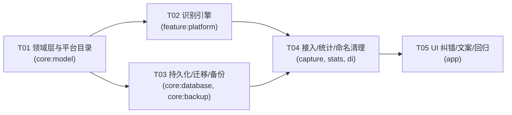
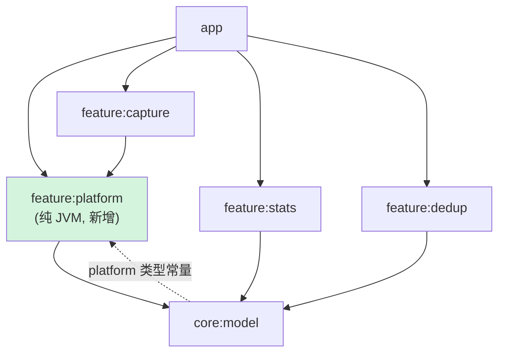

# 消费平台 / 商户 改造方案 —— 系统设计与任务分解

> 设计人：架构师 高见远 ｜ 日期：2026-09-27 ｜ 状态：**待评审 → 待实现**
> 本文件为**只读审计 + 设计产物**，不含任何代码改动。所有行号引用基于当前工作区快照。

---

## 0. 需求锚点与设计目标

| 用户诉求 | 设计对应章节 |
|---|---|
| 只保留两个业务概念：消费平台（可枚举）、商户（独立可编辑） | §1 |
| 二者互不覆盖；统计同时支持「按平台」和「按商户」两个维度 | §1.1 / §1.3 / §4 |
| 从原文自动识别；无法唯一确定时给候选建议 | §3 |
| 识别可纠正：低置信要明确提示、用户改后即时生效且优先于自动值 | §5 |
| 数据/识别/查询/文案同步更新，覆盖边界情况 | §2 / §4 / §7 |
| 历史数据留「未知」即可（测试版） | §2.3 |
| 彻底清除「渠道」命名残留 | §4.4 |

---

## 1. 概念与命名方案

### 1.1 三个概念的最终划分（核心决策）

当前代码中「渠道」一词**同时承担了两个完全不同的语义**，这正是本次改造要解开的死结。改造后必须严格三分：

| 概念 | 是什么 | 用户是否可见 | 持久化字段 | 现状 |
|---|---|---|---|---|
| **消费平台**（新增） | 这笔消费发生在哪个业务平台：微信 / 支付宝 / 美团 / 拼多多 / 抖音 / 淘宝 | ✅ 一级业务概念 | `platform_id`（新增） | **无**，需新建 |
| **商户** | 具体的收款方 / 店名 / 对方户名 | ✅ 一级业务概念 | `counterparty`（已有） | 已有，但统计与 UI 称呼不统一 |
| **采集来源**（技术字段） | 这条记录是**怎么抓到的**：通知 / 短信 / 账单导入 / 手动 | ⚠️ 仅在「审计排查」场景展示，**不作为业务维度** | `source_id` / `source_ref`（已有） | 已有，但被错当好「渠道」业务维度暴露 |

> **关键判断**：`sourceId` **必须保留**，不得删除、不得改名为「平台」。理由见 §1.2。

### 1.2 【明确结论】`sourceId` 应当保留，但降级为「技术追溯字段」

**结论：保留 `sourceId` / `sourceRef` 字段名与字段本身，取消它的一切业务维度身份。**

| 维度 | 理由 |
|---|---|
| ① 去重依赖它 | `LedgerDuplicateResolver.findDuplicates` 用它判定 `crossSource`（`LedgerDuplicateResolver.kt:62`）；跨进去重判定的核心信号就是"是否来自不同采集侧"。删掉 = 去重退化 |
| ② 追溯依赖它 | `sourceRef` 要关联通知 key / 短信 `_id` / CSV 行号，用于「这笔账到底从哪条原始消息来的」审计（`Model.kt:30`） |
| ③ 它是采集插件契约 | `CaptureSource.id` 与之一一对应，`IngestPipeline` 全链路靠它识别来源（`IngestPipeline.kt` draft 构造） |
| ④ 成本极小 | 它就是一对 String，**不需要改列名**，只需改「不再对外叫渠道」 |

**处置动作（三件事）**：
1. 删除一切把 `sourceId` 当业务维度暴露的代码 —— 即 `AppContainer.channelNames`（`AppContainer.kt:230-235`）与 `ChannelShareMetric`（`Metrics.kt:75-92`）。详见 §4.3。
2. 在 `Model.kt:28-31` 的 KDoc 补一句强调：**"采集来源（技术追溯字段），不是消费平台（业务字段），勿混用"**。
3. UI 上如果还要展示它，改叫 **「采集来源」**（不再叫渠道），并只出现在「排查为什么没记录」类场景。

### 1.3 字段命名最终表

| 业务概念 | Kotlin 属性 | **数据库列名** | 类型 | 默认值 | 说明 |
|---|---|---|---|---|---|
| 消费平台 | `platformId` | `platform_id` | TEXT | `'unknown'` | 存**稳定 ID 字符串**，不存中文名 |
| 平台识别置信度 | `platformConfidence` | `platform_confidence` | REAL | `0` | 0~1，驱动「不确定」角标 |
| 平台来源 | `platformSource` | `platform_source` | TEXT | `'AUTO'` | `AUTO` / `USER`，驱动「用户覆盖优先」 |
| 商户 | `counterparty` | `counterparty` | TEXT | `''` | **列名保持不变**，见下方决策 |

**为什么 `platformId` 用 String 而不是 Kotlin enum？**

| 方案 | 结论 |
|---|---|
| ❌ `enum class ConsumerPlatform` | 新增平台要改 core:model + Room TypeConverter；且本项目已踩过「sealed/枚举 + 语句位置 `when` 不做穷尽性检查 → 新类型静默渲染空白」的坑（`Common.kt:152-231` 的既有风险）。枚举会把这个风险固化下来 |
| ✅ **稳定 String ID + 数据驱动目录表** | 新增平台 = 往 `PlatformCatalog` 加一条数据；未来还可改为从服务端下发规则包而不重新发版；未知 ID 有兜底，不崩溃 |

**为什么 `counterparty` 列名保持不动（重要取舍）**：

`counterparty`（交易对方）本身是准确的中性术语，且它已在 20+ 处代码（指纹、备份、编辑、统计、排序）稳定使用。**重命名为 `merchant` 需要额外的列迁移 + 备份字段别名 + 全量回归，收益为零。**
结论：**列与属性名保持 `counterparty`，但所有 UI 文案统一叫「商户」**，包括搜索框、编辑对话框、统计卡片标题（既有的 `MerchantTopMetric` 已叫「商户排行」，正好对齐）。

### 1.4 消费平台取值目录

放在 `core:model` 的数据目录对象 `PlatformCatalog`，**新增平台 = 加一条数据**：

| `platformId` | 展示名 | 强关键词（Tier A，0.90） | 中关键词（Tier B，0.60） | 弱线索（Tier C，0.35） | 包名映射（最强 0.95） |
|---|---|---|---|---|---|
| `wechat` | 微信 | 微信支付、微信支付凭证、微信零钱 | 微信 | 财付通、亲属卡 | `com.tencent.mm` |
| `alipay` | 支付宝 | 支付宝、支付宝付款 | 支付宝 | 花呗、余额宝、网商银行(?) | `com.eg.android.AlipayGphone` |
| `meituan` | 美团 | 美团支付、美团外卖 | 美团、大众点评 | 美团优选 | `com.sankuai.meituan` |
| `pdd` | 拼多多 | 拼多多支付 | 拼多多 | 多多钱包 | `com.xunmeng.pinduoduo` |
| `douyin` | 抖音 | 抖音支付 | 抖音、抖音商城 | 巨量引擎 | `com.ss.android.ugc.aweme` |
| `taobao` | 淘宝 | 淘票票 | 淘宝、天猫 | 阿里巴巴 | `com.taobao.taobao` |
| `unknown` | 未知 | — | — | — | — |

设计要点：
- **预留扩展位**：`PlatformCatalog` 提供 `register(PlatformEntry)`（后续可接用户自定义 / 远端下发），`displayNameOf(id)` 对未收录 ID 返回 `"未知平台"` 并保留原 ID，**绝不抛异常**。
- `sortOrder` 用于候选排序稳定化（同分时按目录顺序）。
- 目录**不进 Room**（它是常量数据，不是用户数据），避免为一组常量建表。

---

## 2. 数据结构设计

### 2.1 领域模型（`core:model`）

`Model.kt` 的 `LedgerTransaction`（现 `:17-57`）新增三个字段，**插在 `counterparty` 之后、`note` 之前**，保持"业务主键信息 → 业务维度 → 技术追溯"的阅读顺序：

```kotlin
data class LedgerTransaction(
    // ... 既有字段
    val counterparty: String = "",          // 商户（保持不变）
    // ↓↓↓ 新增：消费平台（业务维度）
    val platformId: String = PlatformCatalog.UNKNOWN.id,
    val platformConfidence: Float = 0f,
    val platformSource: PlatformSource = PlatformSource.AUTO,
    val note: String? = null,
    // ... 其余既有字段
)
```

> 新字段均**有默认值** ⇒ 所有现有构造器调用（`feature/refund/RefundEngineTest.kt:287`、测试夹具、Mapper）**不需要修改**，避免涟漪式重构。

新增文件 `core/model/src/main/java/com/autoledger/core/model/platform/Platform.kt`（对齐 `core/model/refund/` 的既有组织方式）：

```kotlin
enum class PlatformSource { AUTO, USER }

data class PlatformEntry(
    val id: String,
    val displayName: String,
    val strongKeywords: List<String>,
    val mediumKeywords: List<String>,
    val weakKeywords: List<String>,
    val packageNames: Set<String>,
    val sortOrder: Int,
)

object PlatformCatalog {
    const val UNKNOWN_ID = "unknown"
    val BUILT_IN: List<PlatformEntry> = listOf(/* §1.4 七条 */)
    fun all(): List<PlatformEntry>
    fun find(id: String): PlatformEntry?
    fun displayNameOf(id: String): String   // 未收录 → "未知平台"
}
```

### 2.2 Room 实体与索引（`core:database`）

`Entities.kt` 的 `TransactionEntity`（现 `:26-49`）：

```kotlin
@Entity(
    tableName = "transactions",
    indices = [
        Index(value = ["occurredAtMillis"]),
        Index(value = ["fingerprint"]),
        Index(value = ["status"]),
        Index(value = ["type"]),
        Index(value = ["platform_id"]),   // ← 新增：支撑「按平台筛选/分组」
    ],
)
data class TransactionEntity(
    // ...
    val counterparty: String,
    @ColumnInfo(name = "platform_id") val platformId: String,
    @ColumnInfo(name = "platform_confidence") val platformConfidence: Float,
    @ColumnInfo(name = "platform_source") val platformSource: String,  // 存 name()
    val note: String?,
    // ...
)
```

> 三个新列均为 **NOT NULL + 非空默认值**（由 Migration 的 `DEFAULT` 保证），因此 entity 侧不声明可空，避免到处 `!!`。

`Mappers.kt` 的 `toEntity()`(:14) / `toDomain()`(:39) 同步补三行。

### 2.3 【重点】Room Migration 方案

**当前坑：`Migrations.kt:25` 使用了 `fallbackToDestructiveMigration()`。**

```
若只把 DATABASE_VERSION 从 4 提到 5 而不写 Migration
      → Room 找不到迁移路径
      → 触发 destructive fallback
      → transactions 表被删表重建
      → 全部历史流水丢失
```

这与用户说的「历史数据留未知即可」**相悖**——用户的意思是「旧行保留、平台列填 unknown」，**不是「把旧数据删光」**。因此：

**必须显式提供 `Migration(4, 5)`**，Room 会优先使用该迁移，destructive fallback 不再触发。

版本号变更（`core/model/.../Schema.kt`，现 `DATABASE_VERSION = 4` / `BACKUP_VERSION = 4`）：

| 常量 | 现值 | 新值 |
|---|---|---|
| `DATABASE_VERSION` | 4 | **5** |
| `BACKUP_VERSION` | 4 | **5** |
| `LedgerSchema.CURRENT`（行级 schemaVersion） | 4 | **5** |

迁移实现（`Migrations.kt` 追加）：

```kotlin
val MIGRATION_4_5 = object : Migration(4, 5) {
    override fun migrate(db: SupportSQLiteDatabase) {
        // ① 新增三列：旧行一律落到 'unknown' / 0.0 / 'AUTO'，符合"历史数据留未知"
        db.execSQL(
            "ALTER TABLE transactions ADD COLUMN platform_id TEXT NOT NULL DEFAULT '$UNKNOWN'"
        )
        db.execSQL(
            "ALTER TABLE transactions ADD COLUMN platform_confidence REAL NOT NULL DEFAULT 0"
        )
        db.execSQL(
            "ALTER TABLE transactions ADD COLUMN platform_source TEXT NOT NULL DEFAULT 'AUTO'"
        )
        // ② 建索引。名字必须与 Room 对 Index(value=["platform_id"]) 的生成规则一致，
        //    否则 exportSchema 校验会报 "migration didn't properly handle"
        db.execSQL(
            "CREATE INDEX IF NOT EXISTS index_transactions_platform_id " +
                "ON transactions (platform_id)"
        )
    }
}

object LedgerDatabaseFactory {
    fun create(...) = Room.databaseBuilder(...)
        .apply { if (openHelperFactory != null) openHelperFactory(openHelperFactory) }
        .addMigrations(MIGRATION_4_5)          // ← 新增：让破坏性回退不再有机会触发
        .fallbackToDestructiveMigration()      // ← 保留（作为最后兜底），但实际不会再走到
        .build()
}
```

配套：
- **`core/database/schemas/.../5.json`** 会由 KSP `exportSchema=true` 自动生成，**必须一并提交入库**（当前 `2.json/3.json/4.json` 已在库）。
- **不要**在迁移里做「按 rawText 回填平台」的一次性重算：原文需解密、量大、且用户明确说历史不重要。留 unknown 即可，用户打开该笔时可即时补 。

### 2.4 DAO / Repository

| 能力 | 接口 | 位置 | 说明 |
|---|---|---|---|
| 按平台筛选 | `suspend fun listSince(from, includeTransfers, platformIds: Set<String>)` | `LedgerRepository` | 复用 `includeTransfers` 的既有语义（**false 会同时排除 TRANSFER 与 REFUND**，见 `Spi.kt:125`） |
| 改平台 | `suspend fun assignPlatform(id: String, platformId: String)` | `LedgerRepository` | 与既有的 `assignCategory(id, categoryId, confidence)`(:150) 对称 |

**设计决策：统计聚合不加 SQL。** 现有 Metric 全部走内存聚合（`ExpenseMath.netBy(txns)`），数据量在本场景不大，加 SQL 反而引入 DAO 与出资" SQL 字符串多处改动。
**但**——考虑到 B4 已经把账单页改为 Flow 订阅，若后续需要 SQL 侧按平台过滤，在 `TransactionDao` 加 `@Query("... WHERE platform_id IN (:ids)")` 即可，不影响现有契约。

### 2.5 备份 JSON 兼容（`core:backup`）

| 改动点 | 位置 | 做法 |
|---|---|---|
| 导出写入 | `BackupManager.kt:242-253` `toJson()` | 追加 `platformId` / `platformConfidence` / `platformSource` 三个 `put` |
| 导入读取 | `BackupManager.kt` `fromJson()`（约 `:210-239`） | 用 **`optString` 带默认值**读取：`optString("platformId", PlatformCatalog.UNKNOWN_ID)` |

**兼容策略（单向友好）**：
- **新 App 读旧备份（v4 无平台字段）** → `optString` 兜底为 `unknown` / `0.0` / `AUTO` ⇒ 导入不报错，缺失的平台由用户后续补，或导入后点「重算平台」触发一次性识别。
- **旧 App 读新备份** → 当前 `fallbackToDestructiveMigration` 期的旧 App 已不存在，不需双向兼容。
- **不做字段别名**（如同时写 `channel` 和 `platform`）：增加冗余且无消费方，违反「不为不存在的未来买单」。

备份版本号 `BACKUP_VERSION` 4→5，`ImportOutcome.fileVersion/migratedToVersion`（`:40-42`）随之体现，无需额外迁移链路（字段级兜底已足够）。

---

## 3. 识别逻辑设计

### 3.1 模块归属

**结论：新增纯 JVM 模块 `feature:platform`**（与 `feature:dedup` / `feature:refund` 同级）。

| 候选位置 | 结论 |
|---|---|
| `feature:capture` | ❌ 该模块是 Android 模块（`NotificationCaptureSource` 等依赖 Android API），引擎放这里做 JVM 单测需要 Robolectric，违背「必须纯 JVM 可单测」 |
| `core:model` | ❌ 违反本项目已确立的分层惯例：**领域类型放 `core:model`，引擎只在 `feature:*`**（见 `docs/refund-design.md:16`、退款既是如此落地） |
| ✅ **新增 `feature:platform`** | 纯 JVM，无 Android 依赖，与 `feature:dedup` 完全同构；`settings.gradle.kts` 加一行 include 即可 |

依赖：`feature:platform` → `core:model`（仅此一项），**不依赖 `core:database`**（守住 A1 那条架构约束）。

`settings.gradle.kts` 在 `feature` 段落追加（对齐现有注释风格）：
```kotlin
include(":feature:platform")  // 消费平台识别引擎（纯 JVM）
```

### 3.2 接口签名

```kotlin
// ---- core:model ... /platform/Platform.kt ----
data class PlatformContext(
    val rawText: String?,        // 解密后的原文（通知正文 / 短信正文）
    val counterparty: String?,   // 已有的商户名，可作弱线索
    val packageName: String?,    // 通知来源包名（最强线索）
    val sourceId: String,        // 采集来源（技术字段，仅用于降级策略，不参与平台判定）
)

data class PlatformMatch(
    val platformId: String,
    val score: Float,            // 0~1
    val evidence: String,        // "包名 com.tencent.mm" / "命中强词「微信支付」"，供 UI 解释"为什么"
)

data class PlatformResolution(
    val platformId: String,                 // 最终取值（可能是 unknown）
    val confidence: Float,
    val candidates: List<PlatformMatch>,    // topN=3，按 score 降序
    val ambiguous: Boolean,                 // true ⇒ UI 必须打「不确定」角标
)

interface PlatformResolver {
    val id: String
    fun resolve(ctx: PlatformContext): PlatformResolution
}
```

**为什么候选（`candidates`）不入库**：

1. 候选是**一次性和上下文无关**的——随时可用同样的 `rawText`（库里有 `rawTextSealed`，用既有 `CryptoBox` 解一次）重算，不需要持久化第 2~3 名。
2. 落 `extras`（`Model.kt:51`）会让每次识别都写 JSON，且 `extras` 已承载 tags，**混用会把 UI 每次解析都变成 JSON parse**。
3. 用户打开了某笔流水 → UI 调一次 `resolve()` → 拿候选渲染。简单、无状态、零存储的额外负担。

### 3.3 匹配算法与阈值

**评分分层**（命中即累加，取该层定义分）：

| 优先级 | 信号来源 | 得分 | 说明 |
|---|---|---|---|
| 1 | `packageName` 命中 `PlatformEntry.packageNames` | **0.95** | 最强：包名是系统给的确认事实（微信通知一定是微信） |
| 2 | Tier A 强词命中 rawText | 0.90 | 「微信支付」「抖音支付」这种平台自付渠道措辞 |
| 3 | Tier B 中词 | 0.60 | 「美团」「淘宝」这种可能是商户也可能是平台 |
| 4 | Tier C 弱线索 | 0.35 | 「财付通」——它是微信的持牌主体，但也可能出现在银行短信的对手方描述里 |

**判定阈值**（放 `PlatformResolver` 伴生对象，便于调参与单测）：

```kotlin
const val TOP_N              = 3
const val UNKNOWN_THRESHOLD  = 0.35f   // top1 < 0.35 ⇒ platformId = unknown
const val CONFIRM_THRESHOLD  = 0.75f   // top1 ≥ 0.75 且非歧义 ⇒ 直接采用，不打角标
const val AMBIGUOUS_GAP      = 0.15f   // top1 - top2 < 0.15 ⇒ ambiguous = true（即使 top1 很高）
const val AMBIGUOUS_TOP_FLOOR= 0.50f   // top2 ≥ 0.50 才算「真候选」，避免把噪声当第二选择
```

**决策流程**：

```
① 收集所有平台的 hits（包名 / 强 / 中 / 弱）
② 每个平台取最高分；无命中 → Resolution(unknown, 0.0, [], false)
③ 排序，取前 TOP_N 且 score ≥ AMBIGUOUS_TOP_FLOOR 作为 candidates
④ top1 < UNKNOWN_THRESHOLD → platformId = unknown, confidence = top1.score
⑤ ambiguous = (存在 top2) && (top1 - top2 < AMBIGUOUS_GAP) && (top2 ≥ FLOOR)
⑥ confidence = top1.score；platformId = top1.platformId
```

**为什么 `AMBIGUOUS_GAP` 独立于 `CONFIRM_THRESHOLD`**：典型的「淘宝 + 支付宝」场景，两者都超过 0.75，**任何一个阈值单独来看都"很有把握"，但它们互相打架**。只有 gap 能识别这种"两个都高 ⇒ 说明有冲突"的语义。这是用户「无法唯一确定时给候选建议」诉求的核心机制。

### 3.4 与现有解析器的关系

**不改 `NotificationParser`（`NotificationParser.kt:31-57`），在其之后串一步。**

理由：`NotificationParser` 的职责是「这一串文本是不是一笔钱 + 多少钱 + 哪个商户」，它已经通过 `bodyRejectAny` 做了大量"是不是营销短信"的过滤。**把平台识别塞进去会让单个类承担两种正交职责，且每条规则都要写一遍平台配置**（既有 8 条规则 × 6 平台 = 配置爆炸）。改为：

```
RawEnvelope(player: rawText, packageName)
   ↓ NotificationParser.parse()  ← 现有不动
   ↓ PlatformResolver.resolve(PlatformContext(rawText, counterparty, packageName, sourceId))
   ↓ IngestPipeline 装配
```

`RawEnvelope`（`Model.kt:109-123`）已有 `packageName` 字段 ⇒ **不需要给 `RawEnvelope` 加字段**。

> 注意 `SmsCaptureSource` 传的是 `packageName = "sms:inbox"`，它**不会**命中任何平台包名映射，正确处理：银行短信本就该走 Tier A/B/C 关键词，或落 unknown。

### 3.5 ★ 关键决策：平台**不参与**去重指纹

**结论：`fingerprintOf` 保持现状，绝对不要把 `platformId` 加进指纹材料。**

```kotlin
// LedgerDuplicateResolver.kt:33-42 现状
override fun fingerprintOf(txn: LedgerTransaction): String {
    val entity = normalize(txn.counterparty)
    val fingerprintMaterial = if (entity.isBlank()) {
        "${txn.amountMinor}|blank|${txn.sourceId}|${txn.sourceRef}"
    } else {
        "${txn.amountMinor}|$entity"
    }
    return sha256(fingerprintMaterial)
}
```

**理由（这是会真实踩到的坑）**：用户现实场景是「一次美团支付 → 同时产生 ①美团 App 通知 ②银行卡消费短信」。

| 两侧 | platformId | 若把平台放进指纹 |
|---|---|---|
| 美团通知 | `meituan` | 指纹 A |
| 银行短信 | `unknown`（短信里不会写"美团"） | 指纹 B |
| ⇒ A ≠ B ⇒ **跨渠道去重完全失效**，同一杯咖啡记成两笔 |

这与当初**刻意不把 `sourceId` 放进指纹**是同一个道理（`LedgerDuplicateResolver.kt:17-19` 注释已写明）：
> 「两个渠道的时间戳可能差几十秒甚至跨分钟，放进指纹反而会漏判」

因此 `TxnEdit.applyTxnEdit`（`TxnEdit.kt:15-26`）虽然会重算指纹，但**因为平台不参与指纹，修改平台不会造成任何指纹漂移**，现有重工逻辑零负担。

**配套：合并时继承平台。** 在 `IngestPipeline` 合并分支（现调用 `duplicateResolver.merge(...)`）之前补一条：**若 primary 的平台是 `unknown` 而 duplicate 有明确平台，把明确值继承到 primary**（并且 platformSource=AUTO，用户可再改）。这解决了"银行短信（unknown）被合并进微信通知（wechat）时信息不丢"。

---

## 4. 查询与统计

### 4.1 统计：新增 `PlatformShareMetric`，替换 `ChannelShareMetric`

`feature/stats/.../Metrics.kt`：

```kotlin
/** 消费平台分布 —— 一眼看出钱主要花在哪个平台上 */
class PlatformShareMetric(private val topN: Int = 6) : MetricProvider {
    override val id: String = PLATFORM_ID              // "platform_share"
    override val title: String = "消费平台分布"
    override val dimension: Dimension = Dimension.PLATFORM
    override val order: Int = 30

    override suspend fun compute(range: TimeRange, repo: LedgerRepository): MetricResult {
        val txns = repo.listRange(range.startMillis, range.endInclusiveMillis)
        val buckets = ExpenseMath.netBy(txns) { it.platformId }   // 与 MerchantTopMetric 同套路
        val slices = buckets.entries.sortedByDescending { it.value }.take(topN)
            .map { (key, minor) ->
                MetricResult.Breakdown.Slice(
                    key, PlatformCatalog.displayNameOf(key), minor, "#5C88B8",
                )
            }
        return MetricResult.Breakdown(PLATFORM_ID, title, null, buckets.values.sum(), slices)
    }
    companion object { const val PLATFORM_ID = "platform_share" }
}
```

**与现有 `MerchantTopMetric`（`:53-72`）形成对称的「两个维度」**，正好满足用户「同时支持按消费平台和按商户」的诉求。

> 无需改动 `MetricResult`：`Breakdown` 已是既有 sealed 分支，本次**不新增 `MetricResult` 子类型**，因此不会触发已记录的「sealed + 语句位置 `when` 不检查穷尽性」（`Common.kt:152-231`）风险。

### 4.2 `Dimension` 枚举（`core/model/.../Stats.kt:12`）

```kotlin
// 现状：enum class Dimension { CATEGORY, MERCHANT, CHANNEL, ACCOUNT, TIME }
// 改为：
enum class Dimension { CATEGORY, MERCHANT, PLATFORM, ACCOUNT, TIME }
```

`CHANNEL` → `PLATFORM`：**直接替换，不保留 `CHANNEL`**（全仓仅 `Metrics.kt:78` 一处使用，无外部兼容负担）。

### 4.3 筛选实现位置

| 场景 | 实现位置 | 说明 |
|---|---|---|
| 账单页按平台筛选 | `LedgerStore.visibleItems()`（`AppStores.kt`） | 与现有 `tagFilter` / `showTransfers` 同一套模式，最小改动 |
| 统计卡片 | `PlatformShareMetric.compute()` | 内存聚合，不加 SQL |
| 未来如需 SQL 过滤 | `TransactionDao` + `LedgerRepository` | 预留，本次不动 |

### 4.4 「渠道」命名清理清单（**精确打击，不要一刀切**）

> ⚠️ **最重要的提醒**：代码中绝大多数「渠道」指的是**采集渠道 / `CaptureSource`**，那是**合法的、另一个技术概念**，本次**不应**改动。一刀切重命名会造成大量无意义 diff 并引入 bug。

**必须清理的（业务维度混淆点，共 5 处）**：

| # | 位置 | 现状 | 动作 |
|---|---|---|---|
| 1 | `AppContainer.kt:230-235` | `channelNames = mapOf("notify"→"支付通知", …)` | **删除整个属性** |
| 2 | `AppContainer.kt:43` | `import com.autoledger.feature.stats.ChannelShareMetric` | 删除 import，改 import `PlatformShareMetric` |
| 3 | `AppContainer.kt:273` | `ChannelShareMetric(channelNames)` | 改为 `PlatformShareMetric()` |
| 4 | `AppStores.kt:23,177,548` | 引用 `ChannelShareMetric.CHANNEL_ID` 做排除/包含 | 改为 `PlatformShareMetric.PLATFORM_ID` |
| 5 | `Metrics.kt:75-92` | `ChannelShareMetric` 类本体 | 替换为 `PlatformShareMetric`（见 §4.1） |
| 6 | `Stats.kt:12` | `Dimension.CHANNEL` | 改名 `PLATFORM` |

**明确要保留的（不要动！）**：

| 位置 | 现状文案 | 为什么保留 |
|---|---|---|
| `CaptureAndSettings.kt:105` | 「自动采集渠道」 | 说的是 `CaptureSource` 列表，正确 |
| `CaptureAndSettings.kt:432` | 「跨渠道重复自动合并」 | 说的是跨 `sourceId` 去重，正确 |
| `AppStores.kt:390,401`、`TxnEdit.kt:11` | 注释里的「渠道」 | 指采集来源，正确 |
| `Spi.kt:11,94,100`、`LedgerDuplicateResolver.kt` 注释 | 「跨渠道去重」 | 技术去重语义，正确 |
| `AppContainer.kt:305,346,365` | 「采集总线」「通知渠道」 | Android `NotificationChannel` 系统概念，无关 |
| `refund/RefundModel.kt:33,154,205` | 「支付渠道」 | 退款第三方支付语义，无关本次改造 |
| `feature/dedup` 测试中 `cross channel`（`:107,147,150-153,167`） | 内部测试名 | 描述跨 source 去重，语义正确 |

---

## 5. 纠错与 UI 交互

### 5.1 「不确定」如何表达

判定条件（UI 侧）：

```kotlin
val platformUncertain = txn.platformConfidence < CONFIRM_THRESHOLD   // < 0.75
                     || platformAmbiguous                            // 由 resolve 时的 gap 判定
```

> `platformAmbiguous` 需要能重算 —— 因为不入库。UI 打开某笔流水时调一次 `resolver.resolve(ctx)` 即可拿到 `ambiguous` 与 `candidates`，**一次调用同时解决「要不要打角标」和「展示哪些候选」两个问题**。

UI 表现（`app/ui/components/TransactionRow.kt` 扩展）：

| 状态 | 表现 |
|---|---|
| 确定（≥0.75 且非歧义） | 平台名（如「微信」），正常色 |
| 低置信 / 歧义 / unknown | 平台名 + **「?」角标 + 次要色 + 文案「平台待确认」**，整行可点（复用现有点行→编辑的手势，`LedgerScreens.kt:198`） |

### 5.2 手动修改如何覆盖并即时生效

**统一到既有的「修正这笔流水」对话框**（`LedgerScreens.kt:242-270`，现已有商户名 + 备注），在其中**增加平台选择器**：

```
修正这笔流水
├─ 商户名        [OutlinedTextField]        ← 既有
├─ 备注          [OutlinedTextField]        ← 既有
├─ 消费平台      [FilterChip 行]            ← 新增
│    候选：微信(推荐) 支付宝 淘宝 ...  未知
│    ↑ candidates 来自 resolver，top1 标「推荐」
└─ 提示：platformUncertain 时显示「自动识别不确定，请确认平台」
```

写入语义：

```kotlin
// TxnEdit.kt 扩展：applyTxnEdit(txn, counterparty, note, platformId, fingerprintOf)
val edited = txn.copy(
    counterparty = counterparty.trim(),
    note = note?.trim()?.ifBlank { null },
    platformId = platformId,
    platformConfidence = 1f,           // 用户指定 = 绝对确定，角标消失
    platformSource = PlatformSource.USER,
)
return edited.copy(fingerprint = fingerprintOf(edited))   // 平台不参与指纹 ⇒ 指纹不变，无副作用
```

**「优先于自动值」如何持久化保证**：
- `platformSource = USER` 是**权威标记**。
- 后续任何自动流程（重解析、合并继承、再次 ingest）都必须遵守：**`platformSource == USER` 时不得改写 `platformId`**。这是唯一需要新增的守卫条件，放在 `IngestPipeline` 与「合并继承」两个写入路径上。

**「即时生效」怎么做**：
- 平台改动后 UI 立刻刷新 —— 注意 **B4 尚未完成，账单页（`LedgerStore`）当前仍是手动刷新**（`AppStores.kt:213`，见 `docs/review/roadmap-audit.md` B4 结论）。
- 本期做法：**沿用现有模式**，对话框确认后 `store.load()`（与删除/改分类的既有一致行为）。
- 后续 B4 补齐后，Flow 会自然接管，无需再改。

### 5.3 各入口汇总

| 入口 | 位置 | 改动 |
|---|---|---|
| 快速补记表单 | `LedgerScreens.kt:100-115`（商户 / 备注） | 增加平台选择器（可留空 ⇒ unknown） |
| 流水行 | `components/TransactionRow` | 增加平台名展示 + 不确定角标 |
| 修正对话框 | `LedgerScreens.kt:242-270` | 增加平台选择 |
| 账单搜索 | `LedgerScreens.kt:150-157`（现有 hint「搜索商户 / 备注 / 金额」） | 提示改为「搜索商户 / 平台 / 备注 / 金额」，匹配时把 `displayNameOf(platformId)` 纳入 |
| 账单筛选 | `LedgerStore.visibleItems()` | 增加平台 FilterChip 行（照抄既有 `tagFilter` 写法） |
| 统计页 | `InsightScreens.kt` 的 metrics 选取（`AppStores.kt:548`） | `CHANNEL_ID` → `PLATFORM_ID` |

---

## 6. 任务分解（有序，依赖自左向右）

> 规则：每个任务 ≥3 个文件；T01 为基础，其余尽量只依赖 T01/T02。

### T01 — 领域层与平台目录（纯 JVM，无 IO）

**依赖**：无 ｜ **优先级**：P0

| 文件 | 动作 |
|---|---|
| `core/model/.../platform/Platform.kt` | **新增**：`PlatformSource`、`PlatformEntry`、`PlatformCatalog`（7 条数据）、`PlatformContext`、`PlatformMatch`、`PlatformResolution`、`PlatformResolver` 接口 |
| `core/model/.../Model.kt` | `LedgerTransaction` 增 3 个带默认值字段（`:26` 之后）；`Model.kt:28-31` KDoc 强调 sourceId 是技术字段 |
| `core/model/.../Stats.kt` | `:12` `Dimension.CHANNEL` → `PLATFORM` |
| `core/model/.../Schema.kt` | `DATABASE_VERSION` 4→5、`BACKUP_VERSION` 4→5、`CURRENT` 4→5 |

**验收**：`core:model` 单独编译通过；`PlatformCatalog.displayNameOf("不存在")` 返回「未知平台」不抛异常。

### T02 — 识别引擎 + 单测（纯 JVM）

**依赖**：T01 ｜ **优先级**：P0

| 文件 | 动作 |
|---|---|
| `settings.gradle.kts` | `feature` 段追加 `include(":feature:platform")` |
| `feature/platform/build.gradle.kts` | **新增**，照抄 `feature/dedup` 的纯 JVM 配置（只依赖 `:core:model` + coroutines + `kotlin("test")`） |
| `feature/platform/.../KeywordPlatformResolver.kt` | **新增**：§3.3 六步算法，阈值为伴生常量 |
| `feature/platform/src/test/.../KeywordPlatformResolverTest.kt` | **新增**：七类边界用例（见 §7） |

**验收**：新增 JVM 单测全绿；仅依赖 `:core:model`（无任何 Android/Room import）；加入既有 324 用例不冲突。

### T03 — 持久化、迁移与备份兼容

**依赖**：T01 ｜ **优先级**：P0

| 文件 | 动作 |
|---|---|
| `core/database/.../Entities.kt` | `TransactionEntity`(:26-49) 增 3 列 + `Index(["platform_id"])` |
| `core/database/.../Migrations.kt` | 新增 `MIGRATION_4_5`（§2.3 SQL），`.addMigrations()` 接线 |
| `core/database/.../repository/Mappers.kt` | `toEntity()`(:14) / `toDomain()`(:39) 补 3 行 |
| `core/database/.../repository/RoomLedgerRepository.kt` | 新增 `assignPlatform(id, platformId)`；`listSince/listRange` 增可选 `platformIds` |
| `core/backup/.../BackupManager.kt` | `toJson()`(:242-253) 写入；`fromJson()`(~:210-239) 用 `optString` 默认值读 |
| `core/database/schemas/.../5.json` | 自动生成后**提交入库** |

**验收**：真机/单测验证 v4 备份可导入且平台落 unknown；SQLite 校验 `index_transactions_platform_id` 存在。

### T04 — 识别接入、统计改造与命名清理

**依赖**：T02, T03 ｜ **优先级**：P1

| 文件 | 动作 |
|---|---|
| `feature/capture/.../IngestPipeline.kt` | 在 draft 构造后串一步 `PlatformResolver.resolve(...)`；**守卫 `platformSource == USER` 不覆盖**；合并时「unknown ← 明确」继承 |
| `feature/stats/.../Metrics.kt` | `:75-92` `ChannelShareMetric` → `PlatformShareMetric`（§4.1） |
| `app/.../di/AppContainer.kt` | 删 `channelNames`(:230-235)；`:43` import 替换；`:273` 注册 `PlatformShareMetric()`；装配 `platformResolver` |
| `feature/stats/src/test/.../MetricsTest.kt` | `:155-171,255` 三个渠道相关用例改为平台用例 |
| `app/.../ui/stores/AppStores.kt` | `:23` import、`:177` 排除、`:548` 包含 → 改 `PLATFORM_ID` |

**验收**：`assembleDebug` 通过；全仓 `grep -i "channel" app/ feature/stats/` 除 Android `NotificationChannel` 外零命中（保留清单见 §4.4）。

### T05 — UI 纠错、文案统一与回归

**依赖**：T04 ｜ **优先级**：P1

| 文件 | 动作 |
|---|---|
| `app/.../ui/stores/TxnEdit.kt` | `applyTxnEdit` 增 `platformId` 参数，写 `confidence=1f` + `source=USER` |
| `app/.../ui/screens/LedgerScreens.kt` | `:242-270` 对话框加平台选择器；`:100-115` 补记表单加平台选择；`:150-157` 搜索 hint 改「商户 / 平台 / 备注 / 金额」 |
| `app/.../ui/stores/AppStores.kt` | `LedgerStore` 增平台 `FilterChip` 状态与筛选（照抄 `tagFilter`） |
| `app/.../ui/components/TransactionRow.kt` | 平台名展示 + 低置信「?」角标 |
| `app/src/test/.../TxnEditTest.kt` | 补<｜hy_place▁holder▁no▁813｜>「改平台不触发指纹漂移」「USER 标记不被覆盖」用例 |
| `README.md` / `CHANGELOG.md` | 文案更新（业务「渠道」→「消费平台 / 商户」；指 `CaptureSource` 的保留） |

**验收**：324+ 用例全绿；手测——自动识别 → 错误时改 → 角标消失 → 重进 App 仍是用户值。

### 依赖图



### 模块依赖（改造后）



> `feature:platform` **不得**依赖 `core:database`（守住 A1 约束，参照 `feature:dedup`）。

---

## 7. 边界情况清单（逐条给预期行为）

| # | 情况 | 预期行为 |
|---|---|---|
| 1 | **空输入**（rawText / title / body 全空） | `platformId=unknown`、`confidence=0.0`、`candidates=[]`、`ambiguous=false`；流水照常入账（平台不影响是否记账）；UI 打「平台待确认」 |
| 2 | **识别失败**（有文本但无关键词命中） | 同 1（unknown / 0.0 / 空候选）。用户可在编辑框手选任意平台 |
| 3 | **识别错误**（自动给了抖音，实际是淘宝） | 用户改 → `platformSource=USER`、`confidence=1.0` → 角标消失；**后续任何自动流程不得覆盖**；重进 App 保持用户值 |
| 4 | **取值不存在**（文本提及未收录平台，如「京东支付」） | `unknown` + `confidence` 按 Tier C 可能 0，候选空；UI 提示「未收录该平台」。**本期不自动新增目录条目**（避免目录被脏数据污染），由产品后续补进 `PlatformCatalog` |
| 5 | **多平台命中冲突**（同时含「淘宝」和「支付宝」） | top1=淘宝(0.60) / top2=支付宝(0.60) → gap=0 < 0.15 ⇒ **ambiguous=true**；仍写 top1（淘宝），但 UI 强制打角标并列 3 个候选供一键改。**不因歧义而丢弃这笔账** |
| 6 | **平台与商户混淆**（counterparty 恰为「美团外卖」） | 商户照写「美团外卖」，平台识别 `meituan`，**两个字段独立**。改商户不影响平台，改平台不影响商户。商户排行与平台分布是两个独立卡片 |
| 7 | **包名与文本冲突**（包名=微信，文本有「支付宝」） | 包名 0.95 胜出 ⇒ 微信。包名是系统给的事实，优先级最高；`evidence` 记录「包名 com.tencent.mm」，编辑框可解释「为什么这么判」 |
| 8 | **短信无包名**（`packageName="sms:inbox"`） | 不命中任何包名映射 ⇒ 走关键词；银行短信通常只写「消费 XX 元」⇒ 落 `unknown`，符合预期 |
| 9 | **历史数据** | Migration `DEFAULT 'unknown'` 回填；UI 显示「未知」+ 角标；**不做批量重算**（用户明确说历史不重要，且重算需解密全部原文） |
| 10 | **旧备份导入**（v4 无平台字段） | `optString` 兜底 ⇒ `unknown / 0.0 / AUTO`；**导入不报错**；可在设置提供「重算全部平台」触发一次性识别（可选增强） |
| 11 | **导入含已废弃的 platformId** | `displayNameOf()` 返回「未知平台」并保留原始 ID 字符串，**不抛异常、不丢数据** |
| 12 | **退款 / 内部划转流水** | 平台照常识别（便于追溯「抖音退款」），但不进消费统计（既有 `ExpenseMath` 口径不变，`Metrics.kt:30` 的 netBy 已处理） |
| 13 | **手动补记未选平台** | 留空 ⇒ `unknown`（不是猜测）；若用户在商户填了「美团」可按 Tier B 给 `meituan`，但 `confidence=0.60 < 0.75` ⇒ 会打角标提示确认 |
| 14 | **合并重复时的平台继承** | primary `unknown` + duplicate 明确 ⇒ 继承明确值（`source=AUTO`）；两者都明确且不同 ⇒ **保留 primary**（用户已在看的那一笔不做隐藏变更，改动必须可见） |
| 15 | **同一平台多次小额**（「同一家店同金额」误合并风险） | 平台**不参与指纹**，行为与当前完全一致，无回归（见 §3.5） |
| 16 | **用户先把淘宝改成微信，后来又想改回去** | 每次都是 USER 覆盖，无「恢复自动值」按钮 —— 需要的话可加「重新识别」按钮（调 resolver 重算并置回 AUTO），本期作为可选增强 |

---

## 8. 明确的开放项（需产品/团队确认）

| # | 问题 | 我的默认建议 |
|---|---|---|
| 1 | 「未知」是否要作为一个**可选筛选项**出现在账单页 FilterChip？ | 建议提供，方便集中清理历史数据 |
| 2 | 是否需要在统计页同时常驻「平台分布」与「商户排行」两张卡？ | 建议是（用户明确要两个维度），现有 `InsightScreens` 已支持多卡 |
| 3 | 「重算全部平台」（针对历史/旧备份）是否本期做？ | 建议**不做**（用户说历史不重要），留 TODO |
| 4 | 平台目录未来要不要允许用户自定义（如加「京东」「小红书」）？ | 架构已预留（`PlatformCatalog.register`），但本期不开放 UI |
