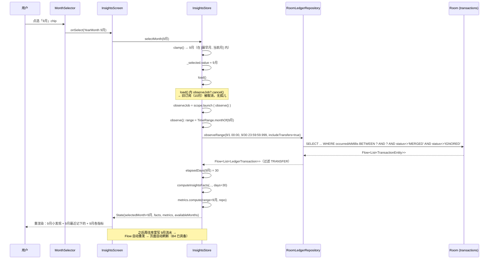
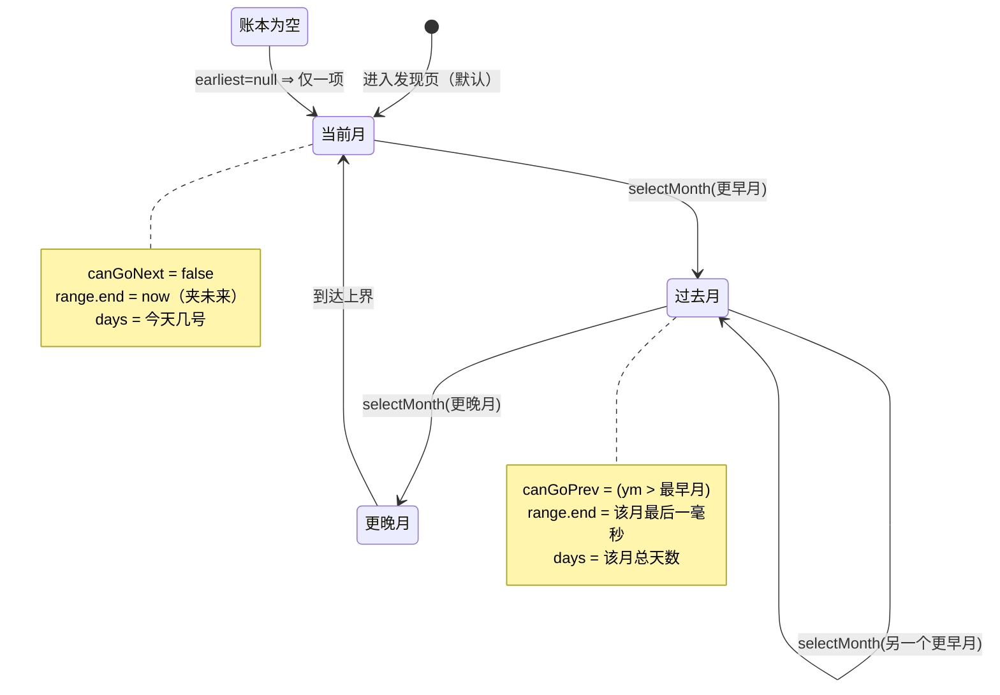
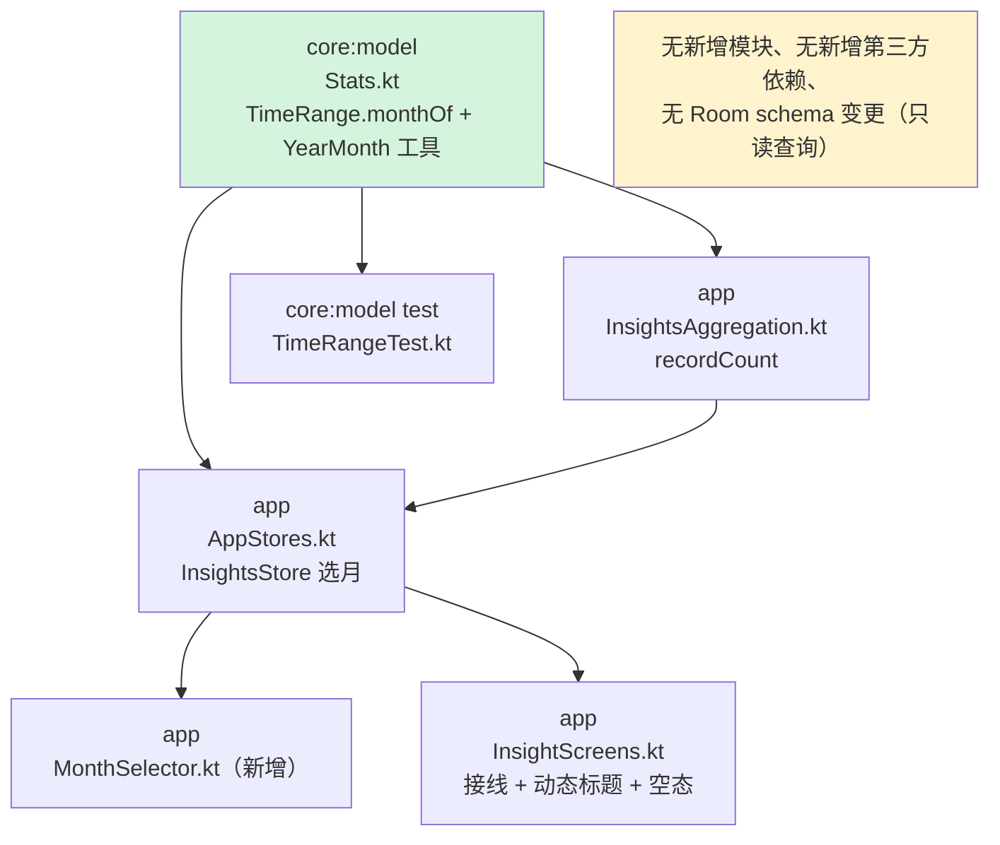

# 「发现」页按月显示 —— 增量设计与任务分解

> 设计人：架构师 高见远 ｜ 日期：2026-09-27 ｜ 范围：**仅「发现」页（`InsightsScreen`）**
> 只读设计产物，未改动任何源码。所有行号基于当前工作区快照。

---

## 0. 需求与目标

用户跨月后看到发现页「什么都没有」，误以为数据丢了（实际数据都在上一月）。诉求：**在发现页能选月份，查看每个月对应的数据。**

设计目标：
1. 发现页新增月份选择，页面口径随选中月切换；
2. **默认选中当前月 ⇒ 与现状完全一致**（向后兼容，零回归）；
3. 空月份必须正常渲染空态，不报错、不白屏；
4. **不动其他页面的当月口径**；
5. 月份切换不得产生孤儿订阅。

---

## 1. 方案概述（先看三条关键发现）

现状：`InsightsStore.observe()`（`AppStores.kt:653-676`）把月份**硬编码**为 `TimeRange.thisMonth(System.currentTimeMillis())`。改造成「可选中月」，本质上就是把这一行换成「用户选中的月」，其余链路（`observeRange` → `computeInsightsFacts` → `metrics`）都天然吃参数。

但复核代码后，发现**三处必须一起处理的坑**，只改月份参数是不够的：

### 发现 1：`TimeRange` 没有「任意月份」构造器，必须新增

`TimeRange` 只有三个工厂（`Stats.kt:68/74/81`）：`today` / `thisMonth` / `lastDays`，**全都锚定在 `now`**。没有「给定年月 → 该月区间」的方法。

而且语义有个关键细节：

| | `thisMonth(now)` | 需要的「任意月」 |
|---|---|---|
| 起点 | 当月 1 日 00:00 | 该月 1 日 00:00 |
| **终点** | **`now`**（`Stats.kt:77`，**不是月末**） | 过去月＝**该月最后一毫秒**；当前月＝仍夹到 `now` |

⇒ 必须新增 `TimeRange.monthOf(...)`，并且**当前月要特殊处理**（沿用 end = now，避免把未来日期的预授权流水算进本月）。

### 发现 2：区间查询是**双闭区间**，右端 off-by-one 是真风险

`TransactionDao.observeRange` / `listRange` 都是：

```sql
WHERE occurredAtMillis BETWEEN :fromMillis AND :toMillis ...
-- Daos.kt:64（listRange）/ :74（observeRange）
```

`BETWEEN` **两端都含**。因此 `monthOf` 的右端必须是**该月最后一毫秒**（`次月1日00:00 - 1ms`），否则：
- 若给「次月 1 日 00:00」→ **把下月第一笔算进本月**（多算）；
- 若给「本月最后一天 00:00」→ **漏掉月末 23:59:59 那天的流水**（少算）。

### 发现 3：`days` 传参语义错误会让「日均花销」失真

`computeInsightsFacts(days = ...)`（`InsightsAggregation.kt`）被调用时传的是：

```kotlin
val days = LocalDate.now(zone).dayOfMonth.coerceAtLeast(1)   // AppStores.kt:662
```

即「今天几号」。看**当前月**时它是对的（已过天数）；但看**过去的月份**时它错了：

| 选中月 | 应传 days | 若沿用「今天几号」 |
|---|---|---|
| 2025-10（今天 10/1） | 1 | 1 ✅ |
| 2025-09（30 天，已完整过完） | **30** | 1 ❌ ⇒ 日均 = 月支出 / 1，**虚高 30 倍** |

⇒ `days` 必须按选中月计算：**当前月 = 今天几号；过去月 = 该月总天数**。

### 发现 4（顺手修）：卡片标题「今日小发现」本身名不副实

`InsightScreens.kt:183` 标题是「今日小发现」，但它下面的数据全部来自 **`thisMonth` 区间**（`observeRange(month.start, month.end)`），是**整月**口径，不是「今日」。这是一个**既有命名 bug**，本次顺手改为动态标题「本月小发现 / 9月小发现」，否则选中 9 月却显示「今日」会很怪。

---

## 2. 数据层改造（`InsightsStore`）

### 2.1 State / Facts 扩展

```kotlin
// AppStores.kt InsightsStore.Facts（现 :615-625）新增一个字段
data class Facts(
    // ... 既有 7 个字段
    /** 该月参与口径的记录条数（spending.size）。用于空态判定，避免 UI 靠"金额都是 0"来猜。 */
    val recordCount: Int = 0,
)

// AppStores.kt InsightsStore.State（现 :627-632）新增四个字段
data class State(
    val loading: Boolean = true,
    val error: String? = null,
    val facts: Facts = Facts(),
    val metrics: List<MetricResult> = emptyList(),
    // ↓↓↓ 新增
    val selectedMonth: YearMonth = YearMonth.now(),
    /** 可选月份，**降序**（当前月在最前）。范围 = [最早一笔流水所在月, 当前月]。 */
    val availableMonths: List<YearMonth> = emptyList(),
    val canGoPrev: Boolean = false,
    val canGoNext: Boolean = false,
)
```

> **为什么用 `java.time.YearMonth`**：项目 `minSdk = 26`，`java.time` 自 API 26 起原生可用（`core:model` 已在用 `ZoneId`/`Instant`，`AppStores.kt:662` 已在用 `LocalDate`），**无需 desugaring**。`YearMonth.minusMonths/plusMonths` 自动进位，跨年不出错。

### 2.2 选中月状态与重订阅策略（核心）

```kotlin
private val _selected = MutableStateFlow(YearMonth.now())
/** 账本最早一笔所在月；懒算一次（不会因为切月而变），上限用于约束选择范围。 */
private var earliestMonth: YearMonth? = null

/** 唯一的月份切换入口：改状态并复用 load() 的取消/重订阅。 */
fun selectMonth(target: YearMonth) {
    val clamped = clamp(target)          // 见 2.4
    if (clamped == _selected.value) return
    _selected.value = clamped
    load()                               // ← 复用既有 load()（:641-645）
}

fun prevMonth() = earliestMonth?.let { selectMonth(_selected.value.minusMonths(1)) }
fun nextMonth() = selectMonth(_selected.value.plusMonths(1))
```

**为什么这样就不会有孤儿订阅**：`load()` 已有

```kotlin
fun load() {
    observeJob?.cancel()                          // ← AppStores.kt:642
    _state.value = _state.value.copy(loading = true, error = null)
    observeJob = scope.launch { observe() }
}
```

`selectMonth` **不自己 launch**，只改状态再调 `load()` ⇒ 每次切换必然先 cancel 上一个 `observeJob`，**同一时刻最多一个订阅**。

> ⚠️ **给工程师的硬约束**：月份绝不能由 UI 直接改 `_selected`；**必须走 `selectMonth()`**。这是唯一能保证「取消 → 重订阅」顺序的地方。若 UI 直接写状态，就绕过了 cancel，产生孤儿订阅（旧月份 Flow 还在推、和新月份抢写 `_state`）。

### 2.3 `observe()` 改造

```kotlin
private suspend fun observe() {
    val ym = _selected.value
    val zone = ZoneId.systemDefault()
    val range = TimeRange.monthOf(ym)        // 新增；当前月自动夹到 now
    // 首次进入时懒算最早月，用于约束可选范围（见 2.4）
    if (earliestMonth == null) {
        val all = container.repository.listAll(includeTransfers = true)   // 与 FreedomStore:586 同法
        earliestMonth = FreedomMath.earliestYearMonthIndex(all, zone)?.let { indexToYearMonth(it) }
    }
    val months = buildMonths(earliestMonth, ym)   // 降序列表

    container.repository
        .observeRange(range.startMillis, range.endInclusiveMillis, includeTransfers = true)
        .flowOn(Dispatchers.Default)
        .catch { e -> _state.value = _state.value.copy(loading = false, error = e.message ?: "加载失败") }
        .collect { allMonth ->
            val days = elapsedDays(ym, zone)               // ← 见发现 3
            val facts = computeInsightsFacts(
                allMonth = allMonth,
                categories = container.repository.listCategories().associateBy { it.id },
                days = days,
                zone = zone,
            )
            val metrics = container.metricRegistry.providers().filter {
                it.id == MerchantTopMetric.MERCHANT_ID ||
                    it.id == PlatformShareMetric.PLATFORM_ID ||
                    it.id == TimeCostMetric.TIME_COST_ID
            }.map { it.compute(range, container.repository) }   // ← 传选中月 range（原来传 month）
            _state.value = State(
                loading = false, facts = facts, metrics = metrics,
                selectedMonth = ym, availableMonths = months,
                canGoPrev = earliestMonth?.let { ym > it } == true,
                canGoNext = ym < YearMonth.now(),
            )
        }
}
```

改动点只有三处（对照现 `:653-676`）：
1. `val month = TimeRange.thisMonth(now)` → `val range = TimeRange.monthOf(_selected.value)`；
2. `val days = LocalDate.now(zone).dayOfMonth` → `elapsedDays(ym, zone)`；
3. `it.compute(month, ...)` → `it.compute(range, ...)`；并在 `State(...)` 里补 4 个新字段。

### 2.4 边界收敛（clamp）与月份列表

```kotlin
/** 上界 = 当前月（不可选未来月）；下界 = 最早流水月（有则约束，无则不约束）。 */
private fun clamp(target: YearMonth): YearMonth {
    val upper = YearMonth.now()
    val lower = earliestMonth
    return when {
        target > upper -> upper
        lower != null && target < lower -> lower
        else -> target
    }
}

/** 降序：[当前月, 当前月-1, ...] 直到下界。上限兜底 240 个月（20 年），防极端脏数据渲染爆量。 */
private fun buildMonths(earliest: YearMonth?, selected: YearMonth): List<YearMonth> {
    val newest = maxOf(YearMonth.now(), selected)
    val oldest = earliest ?: newest
    val out = mutableListOf<YearMonth>()
    var cur = newest
    var guard = 0
    while (cur >= oldest && guard++ < 240) { out += cur; cur = cur.minusMonths(1) }
    return out
}
```

> 账本为空 ⇒ `earliest == null` ⇒ 列表退化为 `[当前月]`（`canGoPrev = false`），符合「边界退化」。

### 2.5 `TimeRange.monthOf` 与天数工具（新增）

```kotlin
// core/model/.../Stats.kt —— TimeRange.companion 内新增，不改动既有 today/thisMonth/lastDays
/**
 * 给定年月 → 该月区间。右端为**该月最后一毫秒**（与 DAO 的 BETWEEN 双闭区间对齐）。
 *
 * 若该月是「当前月」，右端夹到 [now]：与 [thisMonth] 语义一致，避免把未来日期的
 * 预授权 / 跨时区流水算进来（`observeSince` 只有左边界的历史坑见 Spi.kt:160-166）。
 */
fun monthOf(yearMonth: YearMonth, now: Long = System.currentTimeMillis()): TimeRange {
    val firstDay = yearMonth.atDay(1)
    val start = firstDay.atStartOfDay(ZONE).toInstant().toEpochMilli()
    val nextMonthStart = yearMonth.plusMonths(1).atDay(1).atStartOfDay(ZONE).toInstant().toEpochMilli()
    val monthEnd = nextMonthStart - 1L                       // 该月最后一毫秒
    val isCurrent = yearMonth == YearMonth.from(Instant.ofEpochMilli(now).atZone(ZONE))
    val end = if (isCurrent) now.coerceAtLeast(start) else monthEnd
    return TimeRange(start, end)
}
```

> `atStartOfDay(ZONE)` 会正确处理夏令时缺口；`plusMonths(1)` 先跨到次月再减 1ms，**闰年 2 月（29 天）自动正确**，不需要手写 `lengthOfMonth`。

配套两个转换工具（放同一 companion，供 `FreedomMath.yearMonthIndex` 体系互转）：

```kotlin
fun YearMonth.toIndex(): Int = year * 12 + (monthValue - 1)          // 与 FreedomMath.yearMonthIndex 同构
fun indexToYearMonth(index: Int): YearMonth = YearMonth.of(index / 12, index % 12 + 1)
```

`elapsedDays`（放 `AppStores.kt` 内部私有纯函数，便于单测）：

```kotlin
/** 该月"已过天数"：当前月 = 今天几号；已过完的月 = 该月总天数（≥1）。 */
internal fun elapsedDays(yearMonth: YearMonth, zone: ZoneId, now: Long = System.currentTimeMillis()): Int {
    val current = YearMonth.from(Instant.ofEpochMilli(now).atZone(zone))
    return if (yearMonth == current) {
        Instant.ofEpochMilli(now).atZone(zone).dayOfMonth.coerceAtLeast(1)
    } else {
        yearMonth.lengthOfMonth()
    }
}
```

---

## 3. 月份选择器 UI

### 3.1 交互方案

新增独立组件 `app/src/main/java/com/autoledger/app/ui/components/MonthSelector.kt`（放 `components/` 而非塞进页面，便于将来账单页复用）。

| 维度 | 方案 | 理由 |
|---|---|---|
| 主交互 | **横向可滚动 FilterChip 行**（`LazyRow` 或 `Row` + `horizontalScroll`） | 与项目已有的 `FilterChip` 用法（`LedgerScreens.kt:171-177` 标签筛选）风格统一 |
| 排序 | **降序**：当前月在最左，向右越来越早 | 默认选中当前月 ⇒ **首屏即在最左可见，不需要 `scrollToItem`**；升序就得额外做滚动定位，多一个失败面 |
| 辅助交互 | 两侧 `‹` / `›` 两个 `IconButton` 切相邻月 | chips 用于"跳"、箭头用于"扫读"，两者都调同一个 `selectMonth()` |
| chip 文案 | 当年月份显示 `10月`；跨年月份补年份 `2025年12月` | 同一年内不重复年份，减少噪声；跨年必须可辨 |
| 默认选中 | **当前月** | 与现状完全一致 ⇒ 向后兼容；也正好回应用户"刚跨月看不到东西"的困惑（他现在会看到 9 月的 chip） |
| 边界 | 首/末 chip 时对应箭头 `enabled=false`（`canGoPrev/canGoNext`） | 视觉上就表达出"没有更早/更晚" |
| 放置 | `LazyColumn` 的第一个 `item`，位于「X月小发现」卡片**之上** | 选择器是整页口径的控制权，必须在最上；**不做 sticky**（避免与既有布局/间距系统冲突） |

### 3.2 组件签名

```kotlin
@Composable
fun MonthSelector(
    months: List<YearMonth>,
    selected: YearMonth,
    canGoPrev: Boolean,
    canGoNext: Boolean,
    onSelect: (YearMonth) -> Unit,   // 页面侧实现 = store::selectMonth
    modifier: Modifier = Modifier,
)
```

**无状态组件**：只接收数据 + 回调，不持有订阅、不调 Store ⇒ 可预览、可测、将来复用。页面侧唯一接线：

```kotlin
MonthSelector(
    months = state.availableMonths,
    selected = state.selectedMonth,
    canGoPrev = state.canGoPrev,
    canGoNext = state.canGoNext,
    onSelect = store::selectMonth,
)
```

---

## 4. 哪些卡片跟随选中月

| 卡片 / 元素 | 是否跟随 | 说明 |
|---|---|---|
| 「X月小发现」全部 5 项 FactLine | ✅ 跟随 | `largestTxn / topMerchant / weekdayVsWeekend / avgDailyMinor / unclassifiedCount` 全来自 `Facts`，而 `Facts` 由 `range` 驱动（`InsightsAggregation.kt`），**天然随月切换** |
| 卡片标题「今日小发现」 | ✅ 改动态 | 现为硬编码（`InsightScreens.kt:183`）⇒ 改 `"${label}小发现"`，当前月显示「本月小发现」，其它月显示「9月小发现」 |
| `metrics`（商户排行 / 消费平台分布 / 花掉的时间） | ✅ 全跟随 | 三者的 `compute(range, repo)` 都吃 `range`（`Metrics.kt:59/81` 等）；`TimeCostMetric` 会用该月净支出换算工时 ⇒ 语义正是"这个月花掉了多少人生" |
| 「最近记下的」 | ✅ 跟随 | `Facts.recent` 已是该月最近 3 笔（含收入/退款、不含内部划转）；副标题硬编码「本月前几笔」（`InsightScreens.kt:201`）**要一并改成「X月前几笔」** |
| 月度趋势卡 | — 不存在于本页 | 本页 metrics 只筛 `MERCHANT / PLATFORM / TIME_COST`（`AppStores.kt:669-673`），**未注册 `MonthlyTrendMetric`** ⇒ 不存在"趋势窗口 vs 选中月"的语义打架。**这是好事，别顺手把它加进来** |

> 结论：**"跟随"这件事几乎是零成本的**——因为现有实现已经把一切挂在 `range` 上，只是 `range` 的来源从 `thisMonth` 换成 `monthOf(selected)`。

---

## 5. 是否影响其他页面

**明确不动（保持当月/当日口径）**：

| 页面 | 位置 | 为什么不动 |
|---|---|---|
| 首页 | `HomeStore`（`AppStores.kt:105-194`） | 用户只要求发现页；首页「本月」是与"今日"混排的仪表盘，改口径会破坏它的一致性 |
| 自由 | `FreedomScreen` / `FreedomStore`（`InsightScreens.kt:46`、`AppStores.kt:568+`） | team-lead 已明确划线不在范围；且它是"累计 × 月薪"的长期口径，按月切片会让公式自相矛盾（`FreedomMath.kt:20-24` 已写明） |
| 账单 / 采集箱 / 设置 / 退款 | `LedgerScreens` / `CaptureAndSettings` / `RefundScreen` | 与本需求无关 |

**零回归面的保证**：
- `TimeRange.thisMonth` **保持语义不变**（end = now），其他调用方（HomeStore 等）不受影响；
- `monthOf` 是**纯新增方法**，不改任何既有函数签名；
- `InsightsStore.State` 新增字段**全部带默认值**，`Facts` 新增字段亦带默认值 ⇒ 其它构造点（测试夹具）不需要改。

---

## 6. 数据流

### 6.1 月份切换时序



### 6.2 选中月状态机



### 6.3 文件依赖



---

## 7. 文件清单（相对路径 + 要做什么）

| # | 相对路径 | 动作 | 关键内容 |
|---|---|---|---|
| 1 | `core/model/src/main/java/com/autoledger/core/model/Stats.kt` | 改 | `TimeRange.companion` 新增 `monthOf(yearMonth, now)`（右端=月末最后一毫秒，当前月夹 `now`）；新增 `YearMonth.toIndex()` / `indexToYearMonth()`。**既有 `today/thisMonth/lastDays` 一行不动** |
| 2 | `core/model/src/test/java/com/autoledger/core/model/TimeRangeTest.kt` | 改 | 补 `monthOf` 单测：跨年（12月→次年1月）、闰年 2 月=29 天、右端闭区间（月末 23:59:59.999 命中）、当前月右端夹 `now`、`toIndex/indexToYearMonth` 往返 |
| 3 | `app/src/main/java/com/autoledger/app/ui/stores/InsightsAggregation.kt` | 改 | `computeInsightsFacts` 返回的 `Facts` 补 `recordCount = spending.size`；KDoc 明确 `days` = 「该月已过天数」（当前月=今天几号，过去月=月总天数） |
| 4 | `app/src/main/java/com/autoledger/app/ui/stores/AppStores.kt` | 改 | `InsightsStore`：`Facts` +`recordCount`；`State` +4 字段；新增 `_selected` / `earliestMonth` / `selectMonth` / `prevMonth` / `nextMonth` / `clamp` / `buildMonths`；改 `observe()` 三处（range / days / metrics 参数 + State 四个新字段）；新增 `internal fun elapsedDays(...)` |
| 5 | `app/src/main/java/com/autoledger/app/ui/components/MonthSelector.kt` | **新增** | 无状态横向 chips（降序）+ `‹/›` 箭头；跨年补年份；首末禁用 |
| 6 | `app/src/main/java/com/autoledger/app/ui/screens/InsightScreens.kt` | 改 | `InsightsScreen`：首个 `item` 插 `MonthSelector`；`SectionTitle("今日小发现")` → 动态「{本月\|9月}小发现」；`"本月前几笔"` → 「{本月\|9月}前几笔」；`recordCount == 0` 时显示 `EmptyHint("9月还没有记录")` |
| 7 | `app/src/test/java/com/autoledger/app/ui/stores/InsightsFactsTest.kt`（若不存在则新增；存在则追加） | 改/新增 | `recordCount` 正确；空月 → `recordCount==0` 且各字段零值不抛异常；`elapsedDays` 当前月/过去月/跨年三例 |

---

## 8. 任务列表（有序）

> 依赖：T1 → T2。T1 是纯数据层（可独立编译 + 单测），T2 是 UI 接线。

### T1 — 数据层：时间区间 + 口径 + Store 选月

**依赖**：无 ｜ **优先级**：P0 ｜ **文件**：#1 #2 #3 #4

| 步骤 | 做什么 |
|---|---|
| 1 | `Stats.kt` 加 `monthOf` + 两个 YearMonth 工具（照 §2.5） |
| 2 | `TimeRangeTest.kt` 补 5 个用例（跨年 / 闰年 / 右端闭区间 / 当前月夹 now / index 往返） |
| 3 | `InsightsAggregation.kt`：Facts 补 `recordCount`，KDoc 明确 days 语义 |
| 4 | `AppStores.kt` 的 `InsightsStore`：State/Facts 扩字段、`_selected`、`selectMonth/prev/next/clamp/buildMonths`、`observe()` 三处改动、`elapsedDays` |

**验收**：`:core:model` 与 `:app` 编译通过；`elapsedDays` 与 `monthOf` 单测全绿；**默认选中当前月时，发现页行为与改造前逐像素一致**。

### T2 — UI 层：选择器 + 接线 + 空态

**依赖**：T1 ｜ **优先级**：P0 ｜ **文件**：#5 #6 #7

| 步骤 | 做什么 |
|---|---|
| 1 | 新增 `MonthSelector.kt`（无状态，照 §3.2 签名） |
| 2 | `InsightScreens.kt` 接线：插选择器、标题动态化、副标题动态化、空态 `EmptyHint` |
| 3 | 补 `InsightsFactsTest`（recordCount / 空月 / elapsedDays） |

**验收**：手动冒烟——①进页面默认当前月；②点「9月」各卡片同步切换；③点一个空月显示空态不崩；④点到最早月时 `‹` 禁用；⑤反复快速来回切月不出现重复数据/闪烁（无孤儿订阅）；⑥切出去再回来（`DisposableEffect` → `close()`）无残留。

### （可选后续，不列为任务）

- `TransactionDao` 加 `@Query("SELECT MIN(occurredAtMillis) FROM transactions WHERE status <> 'MERGED'")` + `LedgerRepository.earliestOccurredAtMillis()`，替代 `listAll` 全表读（当前用全表读是**为省一个新接口**，账本大时可优化）。
- 月份选择器 sticky header / 快捷「近 3 月」。

---

## 9. 风险点

| # | 风险 | 后果 | 规避 |
|---|---|---|---|
| **R1** | **孤儿订阅**：若 UI 直接改 `_selected` 或另起一个 `scope.launch { observe() }`，绕过 `load()` 的 `observeJob?.cancel()` | 旧月份 Flow 仍活着，与新月份**抢写 `_state`**，页面出现"跳月/闪回/数据错乱" | 硬约束：**月份只能经 `selectMonth()` 改**，唯一重订阅入口是 `load()`（`AppStores.kt:641-645` 已有的 cancel 模式） |
| **R2** | **右端 off-by-one**：`monthOf` 给了次月 1 日 00:00 或本月最后一天 00:00 | `BETWEEN` 双闭区间 ⇒ 多算下月一笔 / 漏算月末当天 | `monthEnd = 次月1日00:00 - 1ms`；**单测必须断言"月末 23:59:59.999 的记录被包含、次月 1 日 00:00 的记录不被包含"** |
| **R3** | 当前月右端未夹 `now` | 未来日期的预授权/跨时区流水算进本月 | `monthOf` 对当前月 `end = now`（与 `thisMonth` 对齐） |
| **R4** | **日均虚高**：`days` 沿用「今天几号」 | 看 9 月时日均 = 月支出/1，**虚高数十倍**，用户会以为数据错 | `elapsedDays()`：当前月=今天几号，过去月=`lengthOfMonth()`；**单测钉死** |
| **R5** | 跨年标签歧义 | 同一屏出现两个「12月」难辨 | 非当年月份补年份「2025年12月」 |
| **R6** | 账本为空时 `availableMonths` 退化 | 若 `buildMonths` 不做 `null` 兜底，可能空列表 / 死循环 | `earliest == null ⇒ [当前月]`；`while` 加 `guard < 240` 上限（防脏数据爆量） |
| **R7** | 性能：每次 `load()` 全表读一次求最早月 | 大账本下切换月有可感延迟 | ①最早月**懒算一次**并缓存（不随切月重算）；②可选改 MIN 查询（§8 后续项） |
| **R8** | 与 B4「实时刷新」的关系被误判 | 以为改了月份就得手写刷新 | 发现页 `InsightsStore` **已经是 `observeRange` 订阅**（`AppStores.kt:658`）⇒ 选中月内新增流水会**自动**重发。**不需要**再调 `load()` 刷新 |
| **R9** | 顺手把 `MonthlyTrendMetric` 加进发现页 | 趋势卡按"以选中月末为锚的近 6 月"计算，与"选中单月"语义打架，用户困惑 | 明确**不加**（保持 `:669-673` 的三项筛选） |
| **R10** | 误改其他页面口径 | 首页/自由页数据语义被破坏 | `TimeRange.thisMonth` 不改；只新增 `monthOf`；其他 Store 一行不动 |
| **R11** | `State` 字段新增导致既有单测构造失败 | 编译不过 | 新字段**全部带默认值**；`Facts.recordCount` 亦带默认值 = 0 |

---

## 10. 一句话交付摘要

> 本质是把 `InsightsStore.observe()` 里硬编码的 `TimeRange.thisMonth(now)` 换成 `TimeRange.monthOf(selectedMonth)`，并新增 `TimeRange.monthOf`（右端必须取月末最后一毫秒——DAO 用的是双闭 `BETWEEN`）、修正 `days` 语义（过去月要用该月总天数）、加一个无状态的 `MonthSelector`。默认选中当前月 ⇒ 与现状零差异。**唯一不能走错的顺序是：月份只能经 `selectMonth()` → `load()` 切换，否则会产生孤儿订阅。**
