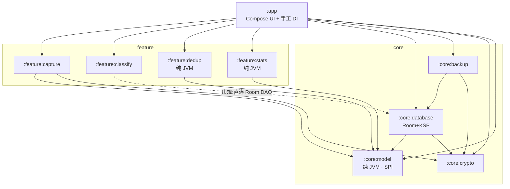

# AutoLedger 架构与工程化专项审查报告

- 审查人：高见远（Architect）
- 审查时间：2026-09-26
- 审查方式：**纯静态审查**。全程未运行任何 Gradle 任务、未编译、未修改任何源码（唯一执行的是只读的 `tools/static_check.py`，它通过）。
- 快照范围：9 个 Gradle 模块的全部 `build.gradle.kts` / `*.kt` / Manifest / XML 资源，以及 **QA 同学新增的 9 个测试源文件**（它们影响 `gradlew build` 的成败，故一并纳入）。
- 一句话结论：**工程当前不可能编译成功——不是"可能有几处报错"，而是 6 处独立致命错误分布在 5 个不同模块里，其中最底层的 `:core:model`（被所有模块依赖）自身就编译不过；与此同时，支撑"可插拔"的 SPI 契约在实际落地中存在两处硬破绽，新增统计维度/采集渠道的真实成本远高于文档宣称。**

> **与 QA 报告的分工**：同一目录下已有 `docs/review/qa-review.md`（严过关）。两份报告的定位是：
> - QA = 正确性 / 运行时行为 / 性能 / 测试资产；
> - 本报告 = 架构与扩展性 / Gradle 工程化 / **构建可成功性预判**。
>
> 编译阻断部分我做了**独立复核**，确认 QA 的 S1–S4 全部成立；在此基础之上，本报告新增了 QA 未覆盖的编译阻断项 **A-S1（`:core:model` 缺 import）**、以及 6 项构建系统级风险（Wrapper / 内存 / 依赖收敛 / 混淆 / 签名 / CI）。两份报告**不冲突、需一起执行**，报告尾部给出了合并后的执行顺序。

---

## 0. 速览

| 级别 | 数量 | 定义 |
|---|---|---|
| **严重** | **8** | 编译失败 / 既定架构约定被破坏 / 会导致静默功能缺失的扩展陷阱 |
| **中等** | **10** | 工程化缺失（构建不可复现、不可持续集成、release 无法产出）、依赖与耦合问题、API 泄漏 |
| **建议** | **10** | 契约收敛、可测性、运维与演进风险 |

**必阻塞首次 `assembleDebug` 的缺陷：6 个**（A-S1 / A-S2 / A-S4 / A-S5 / A-S6，其中 A-S2 同时打在 `:feature:stats` 与 `:app` 上；合计覆盖 `:core:model` `:core:backup` `:feature:capture` `:feature:stats` `:app` 五个模块），详见第六章表格 Ⅰ–Ⅵ。

---

## 一、架构现状基线

### 1.1 实际依赖图（按 `build.gradle.kts` 真实声明绘制）



### 1.2 分层结论

| 约定 | 现状 | 判定 |
|---|---|---|
| app → feature → core，反向依赖应禁止 | 无任何反向依赖 | ✅ 成立 |
| feature 之间零依赖 | capture / classify / dedup / stats 互不引用，全部由 `:app` 的 `AppContainer` 装配 | ✅ 优秀 |
| "feature 层只面向 `LedgerRepository` 编程，不直接碰 Room" | `:feature:classify` 直接依赖 `core:database` 的 `ClassifierRuleDao` / `ClassifierRuleEntity` | ❌ **被自己的注释打脸**（见 A-S7） |
| core 层不认识具体实现 | `core:backup` 构造函数直接吃 `RoomLedgerRepository`（Room 具体类） | ⚠️ 见 A-M3 |
| 无循环依赖 | 当前无环 | ✅ |

### 1.3 "可插拔"的真实改动成本（文档宣称 vs 实际）

| 扩展场景 | 文档宣称 | 我实际逐文件核对的结果 | 判定 |
|---|---|---|---|
| **新增一个采集渠道** | "新建一个实现类 + 注册一行" | 实际上需要动 **4 处**：① 新实现类；② `AppContainer.captureSources` 注册；③ `AppStores.hintOf()` 文案（有 `else` 兜底，不强求）；④ **`CaptureScreen` 的 `when(row.source.id)` 必须新增授权按钮分支，否则新渠道在 UI 上"看得见但按不动"** | ❌ 非零成本，且 UI 强耦合 `id` 字符串字面量 |
| **新增一个分类引擎** | "实现接口注册即可" | 真·零成本：`CompositeClassifier` 按 `order` 排序、纯 `TransactionClassifier` 接口，UI 完全无感 | ✅ 名副其实 |
| **新增一个统计维度** | "写一个类注册即可，UI 一行都不用改" | 注册确实零改动，但**如果新增的是新的结果形态**（第 4 种 `MetricResult` 子类型），`MetricCard` 的 `when` **不会编译报错，界面直接渲染空白**（见 A-S3） | ⚠️ 半个陷阱 |
| **新增一张 bottom tab** | 未宣称 | 需改 `Destination`（含图标/文案）+ `MainActivity.when(current)`（同样无穷尽性检查，同 A-S3 风险） | ⚠️ |

### 1.4 SPI 契约评价（`Spi.kt` / `Stats.kt`）

**做得好的部分（值得保留）：**

1. **契约放在 `core:model`（纯 JVM）而不是 Android 模块** —— 这是整份设计里最有价值的决定，它使得 `:feature:dedup` / `:feature:stats` 天然可在 JVM 上单测（QA 的 109 个用例正是受益于此）。
2. `TransactionClassifier`（带 `order`）+ `CompositeClassifier` 取"最高置信度而非第一个命中"，避免了责任链上"谁排在前面谁说了算"的经典问题。
3. `DuplicateResolver.fingerprintOf()` 是同步函数，`findDuplicates/merge` 是 suspend —— 同步/异步边界划分得干净（指纹必须能在插入前同步算出来）。
4. `Classifiers` 的规则全是数据（`DefaultRulePack` / `NotificationRule` / `TransferRulePack`），为将来"规则包在线下发"留了口子。

**契约设计上的硬伤：**

| 契约成员 | 问题 |
|---|---|
| `CaptureSource.requiredPermissions` / `description` / `needsSystemToggle` | **全工程零消费**（我只找到 1 处 `isSupported` 的实现覆盖，也没有人调用）。它们制造了"框架已经支持权限协商"的假象，而 `CaptureScreen` 实际是用 `when(row.source.id)` 硬编码的。要么删掉，要么让 UI 真的读它。 |
| `CaptureSource.pullBacklog(ctx, args: Map<String, Any?>)` | **弱类型契约**。key 名 `"uri"` / `"sinceMillis"` / `"limit"` 靠口头约定，写错就静默走默认值；且塞的是 `Uri` 这种 Android 类型，导致 `CaptureSource` 无法下沉到 JVM 层测试。 |
| `MetricProvider.compute(range, repo: LedgerRepository)` | 把整个仓储塞给每个 provider：**N 个维度 = N 次相同的 `listRange` 查询**；且强制每个 provider 都依赖一个 Fake 仓储才能测（QA 为此写了两个 `FakeLedgerRepository`）。 |
| `LedgerSchema.CURRENT = BACKUP_VERSION` | 行级结构版本与档案信封版本被强行等号绑定，两者语义并不等价（新增一个字段未必改变档案格式，反之亦然）。 |
| 缺少插件元信息 | 没有 `version` / `capabilities` 字段。规则包（现已在 README 里规划在线更新）一旦可下发，缺少版本号就无法做灰度与回滚。 |

---

## 二、工程化现状基线

| 维度 | 现状 | 评价 |
|---|---|---|
| 版本目录 | `gradle/libs.versions.toml` 结构规范，插件/依赖别名齐全，`tools/static_check.py` 校验别名全部可解析 | ✅ 整体健康 |
| Kotlin / AGP / KSP 版本三角 | Kotlin 2.0.21 ↔ KSP `2.0.21-1.0.25` ↔ Compose Compiler `plugin.compose` 2.0.21 三者**严格对齐** | ✅ 无需改动 |
| Room ↔ KSP | Room 2.6.1 + KSP1 通道，组合成熟 | ✅ 低风险 |
| Room ↔ androidx.sqlite | Room 2.6.1 依赖 sqlite 2.4.0，与显式声明的 `sqlite = "2.4.0"` 一致；`net.zetetic:sqlcipher-android:4.5.5` 的 `SupportFactory` 恰實現 `androidx.sqlite.db.SupportSQLiteOpenHelper.Factory` | ✅ 依赖三角自洽 |
| Gradle 版本 | **没有 Wrapper**，只能依赖脚本装到 `/d/Android/gradle-8.9` 的本地 Gradle；AGP 8.7.3 要求 Gradle ≥ 8.9 | ❌ 不可复现（A-M1） |
| 构建内存 | `org.gradle.jvmargs=-Xmx2048m` | ❌ 偏小（A-M4） |
| 混淆 / 瘦身 | **完全未配置**（无 `buildTypes.release`、无 `proguard-rules.pro`） | ❌ 见 A-M5 |
| 签名 | **完全未配置**，`assembleRelease` 产物无签名、无法上架 | ❌ 见 A-M6 |
| CI | **完全没有**（无 `.github/workflows`） | ❌ 见 A-M7 |
| Room schema 快照 | `core/database/schemas/` 未入库（目录也不存在） | ⚠️ 见 A-M8 |
| 依赖守卫 | 只有 `tools/static_check.py`（查 import 是否有 `project()` 声明 + 分层），**不查 `api/implementation` 泄漏、不查环** | ⚠️ 见 A-M9 |
| minSdk 26 + `java.time` | `core:model`（纯 JVM，面向 JDK 编译）大量使用 `Instant/ZoneId/LocalDate/DateTimeFormatter`。**minSdk 26 恰好是 `java.time` 的可用下限**，因此运行时成立、且不需要 desugar | ✅ 成立但要写成约束（A-L10） |

---

# 三、严重（Severe）

---

### A-S1｜`:core:model` 缺少 `import java.time.Instant`，最底层模块直接编译失败 ★本报告独有

- 【文件:行号】`core/model/src/main/java/com/autoledger/core/model/Stats.kt`（`package` 之后无任何 import；使用点 **:59、:65、:72**）
- 【问题】
```kotlin
package com.autoledger.core.model
/* 整个文件只有注释，没有一条 import */

private val ZONE: java.time.ZoneId get() = java.time.ZoneId.systemDefault()   // ← 这里写了全限定名
...
fun today(now: Long = System.currentTimeMillis()): TimeRange {
    val midnight = Instant.ofEpochMilli(now).atZone(ZONE)   // ← Instant 没有 import，也没有全限定
```
  Kotlin 的默认导入只有 `kotlin.*` / `kotlin.xxx.*` / `java.lang.*` / `kotlin.jvm.*`，`java.time.Instant` **不在其中**。同文件的作者显然意识到了这点（`ZoneId` 就写了全限定），唯独 `Instant` 三处漏了。
- 【产生原因】`TimeRange` 是后补的，且这一条 import 缺失不会被任何"能否 engaged 符号存在"的正则型静态检查发现；项目从未编译过，误差一直潜伏。
- 【影响范围】
  - `:core:model` **编译失败** → 依赖它的 `:core:database` `:core:crypto` `:core:backup` `:feature:*` `:app` **全部失败**，即整个工程编译不过；
  - QA 新增的 `core:model/src/test/.../TimeRangeTest.kt` 也随之编译不了 ⇒ **这是当前唯一的、其他所有错误之前的"第一锹"**。
- 【修改方向】在 `package` 行下方补：
```kotlin
package com.autoledger.core.model

import java.time.Instant
```
  > 建议顺便把 `ZONE` 的全限定写法统一成 import，避免下次再漏：
  > ```kotlin
  > import java.time.Instant
  > import java.time.ZoneId
  > ...
  > private val ZONE: ZoneId get() = ZoneId.systemDefault()
  > ```
- 【优先级】**1**（必须先修，否则后面 4 个错误根本轮不到报）

---

### A-S2｜`LedgerRepository` 没有 `listRange`，且 `RoomLedgerRepository` 第三参数缺默认值（两处错误叠加）

- 【文件:行号】
  - `core/model/src/main/java/com/autoledger/core/model/Spi.kt:89-100`（接口缺方法）
  - `core/database/src/main/java/com/autoledger/core/database/repository/RoomLedgerRepository.kt:73`（`includeTransfers: Boolean` **无默认值**）
  - 调用方：`feature/stats/src/main/java/com/autoledger/feature/stats/Metrics.kt:28, 58, 83, 109, 130`
  - 调用方：`app/src/main/java/com/autoledger/app/ui/stores/AppStores.kt:63, 64, 309`（两参）、`:261`（三参）
- 【问题】两个独立错误叠在一起：
  1. `Metrics.kt` 里 `repo` 的静态类型是 `LedgerRepository`，接口上**没有** `listRange` ⇒ `Unresolved reference`；
  2. 即便给接口补了方法，如果 `RoomLedgerRepository.listRange` 的第三参数**不给默认值**，`AppStores.kt` 的 `:63 / :64 / :309` 三处两参调用仍然报 `No value passed for parameter 'includeTransfers'`。

  > ⚠️ **对 QA 报告 S1 修复方案的更正**：QA 给出的 `RoomLedgerRepository` 片段写的是 `override suspend fun listRange(fromMillis, toMillis, includeTransfers: Boolean)`（**没有 `= false`**）——按该片段改完，`feature:stats` 能过但 `:app` 依然编译失败。**必须带上默认值。**
- 【产生原因】`listRange` 先做在 Room 实现上、忘了回填契约；而 App Stores 又是按"接口应该有默认值"的心智写的调用。这是典型的**契约与实现双向漂移**，且因为没有编译过没被抓住。
- 【影响范围】`:feature:stats` + `:app` 编译失败；若不补全则为后续每次新增统计维度埋同一颗雷。
- 【修改方向】（两处必须同时改）
```kotlin
// ① Spi.kt —— LedgerRepository 增加
suspend fun listRange(
    fromMillis: Long,
    toMillis: Long,
    includeTransfers: Boolean = false,
): List<LedgerTransaction>

// ② RoomLedgerRepository.kt:73 —— 加 override 且给默认值
override suspend fun listRange(
    fromMillis: Long,
    toMillis: Long,
    includeTransfers: Boolean = false,
): List<LedgerTransaction> =
    txnDao.listRange(fromMillis, toMillis).filterTypes(includeTransfers).map { it.toDomain() }
```
- 【优先级】**1**

---

### A-S3｜`MetricResult` 是 sealed，但分发处是"语句 when"——新增维度类型会**静默渲染空白**

- 【文件:行号】`app/src/main/java/com/autoledger/app/ui/components/Common.kt:152-231`（`MetricCard` 的 `when (result)`）；同类风险：`app/src/main/java/com/autoledger/app/ui/MainActivity.kt:98-107`（`when (current)`）
- 【问题】
```kotlin
@Composable
fun MetricCard(result: MetricResult, modifier: Modifier = Modifier) {
    AppCard(modifier) {
        when (result) {              // ← 位于末尾但期望类型是 Unit ⇒ Kotlin 视为"语句"
            is MetricResult.Scalar -> {...}
            is MetricResult.Breakdown -> {...}
            is MetricResult.Trend -> {...}
        }                            // ← 没有 else，且编译期不报"非穷尽"
    }
}
```
  Kotlin 2.0.21 对**语句位置**的 `when` 不做穷尽性检查。于是将来有人按 `Stats.kt` 里"新增一个维度登记进来即可"的注释新增了 `MetricResult.Heatmap`（或第 4 种 result），**编译照过、界面那张卡片变成一块空白区域**，既无崩溃也无日志。
- 【产生原因】"用 `sealed interface` 保证穷尽"的直觉在这里不成立——穷尽性只有把 `when` 当**表达式**用（有非 Unit 的期望类型）时才由编译器保证。
- 【影响范围】README / `Stats.kt` 宣称的"统计维度可插拔"存在**不可见的破口**；`MainActivity` 的 `when(current)` 同理（新增 `Destination` 忘记补分支 ⇒ 点击该 tab 后页面空白）。
- 【修改方向】把分发改成**返回值显式声明为 Unit 的表达式函数**，编译器就会强制穷尽：
```kotlin
@Composable
fun MetricCard(result: MetricResult, modifier: Modifier = Modifier) {
    AppCard(modifier) { ResultBody(result) }
}

@Composable
private fun ResultBody(result: MetricResult): Unit = when (result) {
    is MetricResult.Scalar -> { /* ... */ Unit }
    is MetricResult.Breakdown -> { /* ... */ Unit }
    is MetricResult.Trend -> { /* ... */ Unit }
    // 将来新增子类型 ⇒ 这里直接编译失败，强迫补渲染
}
```
```kotlin
// MainActivity 同样处理
private fun Content(dest: Destination, container: AppContainer): Unit = when (dest) {
    Destination.DASHBOARD -> { DashboardScreen(container); Unit }
    /* ...8 个分支... */
}
```
  > 注意：Kotlin 未来版本（2.1+）对 sealed/enum 的非穷尽 `when` 语句会给出警告乃至报错；届时想维持"静默"反而不行，所以现在就该改。
- 【优先级】**2**

---

### A-S4｜通知监听里调用了 Service 上不存在的 `goAsync()`

- 【文件:行号】`feature/capture/src/main/java/com/autoledger/feature/capture/notify/LedgerNotificationListener.kt:71, 76, 78`
- 【问题】`NotificationListenerService extends Service`，而 `goAsync()` 是 **`BroadcastReceiver`** 的方法。这里 `val token = goAsync()` 与 `token.finish()` 两处都是 unresolved。
- 【产生原因】把广播接收器的"延长进程存活"写法搬到了通知监听服务（该服务的回调本身就是同步的，不需要这种机制）。
- 【影响范围】`:feature:capture` 编译失败 → `:app` 失败。**与 QA 报告 S2 完全一致，此处为二次确认。**
- 【修改方向】
```kotlin
class LedgerNotificationListener : NotificationListenerService() {
    private val scope = CoroutineScope(SupervisorJob() + Dispatchers.IO)   // 保留

    override fun onNotificationPosted(sbn: StatusBarNotification) {
        /* ...解析逻辑不变... */
        scope.launch { CaptureDispatcher.submit(envelope) }   // 删掉 token
    }

    override fun onDestroy() {                                 // 新增：避免 scope 泄漏
        scope.cancel()
        super.onDestroy()
    }
}
```
- 【优先级】**1**

---

### A-S5｜`BackupManager` 使用 `Base64` 但没有 import

- 【文件:行号】`core/backup/src/main/java/com/autoledger/core/backup/BackupManager.kt`（import 区 :1-14；使用点 **:58、:59、:113、:116**）
- 【问题】文件 import 了 `org.json.*`，唯独漏了 `android.util.Base64`，却在加密导出/导入分支里四处使用 `Base64.encodeToString / Base64.decode`。
- 【产生原因】加密分支（`exportEncrypted`）是后补的；且这条 import 缺失从未被验证过 ⇒ **该功能一旦真正上线必然抛异常**。
- 【影响范围】`:core:backup` 编译失败 → `:app` 失败。**与 QA 报告 S3 完全一致，此处为二次确认。**
- 【修改方向】
```kotlin
import android.util.Base64
```
  顺手清掉 `PassphraseKeyDeriver.kt:3` 里从未使用的 `android.util.Base64`（该文件只用到 SecureRandom 与 PBE 派生）。
- 【优先级】**1**

---

### A-S6｜在非 `@Composable` 的 `onClick` 回调里调用 `rememberCoroutineScope()`

- 【文件:行号】`app/src/main/java/com/autoledger/app/ui/screens/CaptureAndSettings.kt:136-142`
- 【问题】
```kotlin
IconButton(onClick = {
    androidx.compose.runtime.rememberCoroutineScope().launch {   // ← Compose 编译器插件报错
        container.repository.markStatus(txn.id, TxnStatus.CONFIRMED)
        store.refresh(context)
    }
}) { Icon(LedgerIcons.Check, "确认入账") }
```
  `IconButton` 的 `onClick: () -> Unit` **不是** `@Composable` lambda，在其中调用任何 `@Composable` 函数都会报 `@Composable invocations can only happen from the context of a @Composable function`。Compose 编译器插件在编译期就拦截，属于硬错误。
- 【产生原因】把"在组合里取 scope"的写法误用到了"事件回调里"。同一份代码库里 `ExpensesScreen` 的做法是对的（`LedgerScreens.kt:57`：`val scope = rememberCoroutineScope()` 放在组合体内，回调只 `scope.launch {}`）。
- 【影响范围】`:app` 编译失败（这是最后一个轮到报错的模块，所以它其实是"第一眼看过去没问题"的那类错误）。**与 QA 报告 S4 完全一致，此处为二次确认。**
- 【修改方向】与 `ExpensesScreen` 对齐：在组合顶部取一次 scope
```kotlin
@Composable
fun CaptureScreen(container: AppContainer) {
    val store = remember(container) { CaptureStore(container) }
    val scope = rememberCoroutineScope()               // 新增
    val context = LocalContext.current
    ...
    IconButton(onClick = {
        scope.launch {
            container.repository.markStatus(txn.id, TxnStatus.CONFIRMED)
            store.refresh(context)
        }
    }) { Icon(LedgerIcons.Check, "确认入账") }
```
- 【优先级】**1**

---

### A-S7｜`:feature:classify` 直接依赖 `core:database` 的 Room DAO，破坏既定分层契约，且让它永远无法做 JVM 单测

- 【文件:行号】`feature/classify/build.gradle.kts:21`；`feature/classify/src/main/java/com/autoledger/feature/classify/Classifiers.kt:3, 16, 56`；`CorrectionLearner.kt:3-4, 16`
- 【问题】`Spi.kt:88` 的注释白纸黑字写着「`LedgerRepository`：**feature 层只面向它编程，不直接碰 Room**」，实现却把 `ClassifierRuleDao` / `ClassifierRuleEntity` 直接握在手里。`AppContainer:105-113` 也得先把 `RoomDatabase` 打开（拿到 DAO）才能构造分类器 —— 这正是 QA 报告中 S5「主线程 + Keystore + SQLCipher 阻塞冷启动」的**结构性根因**：不是 lazy 忘了写，而是**耦合让它没法 lazy 得干净**。
- 【产生原因】为了"少写一层"，把 DAO 当 Repository 用。短期省了一个接口，长期丢掉了：① JVM 可测性；② 规则缓存能力（QA 的 M3 只能在 Room 层做）；③ 替换存储的可能性。
- 【影响范围】`:feature:classify` 永远无法进入 JVM 测试门禁；新建iflor个分类器必须真机 / Robolectric；冷启动链路被锁死。
- 【修改方向】
```kotlin
// 1) core:model 里加一个读取契约（或直接放进 feature:classify 自己）
interface RuleSource {
    suspend fun all(): List<ClassifierRule>
    suspend fun bumpHit(id: String)
    suspend fun upsert(rule: ClassifierRule)
    suspend fun countLearned(): Int
    suspend fun clearLearned()
}
// 2) core:database 提供 RoomRuleSource(ruleDao)；core:model 侧只做适配
// 3) feature/classify/build.gradle.kts：
//      implementation(project(":core:database"))  →  删除
// 4) AppContainer：
val ruleSource by lazy { RoomRuleSource(database.classifierRuleDao()) }
val classifier by lazy { CompositeClassifier(listOf(MemoryClassifier(ruleSource), KeywordClassifier(ruleSource), AmountHeuristicClassifier())) }
```
- 【优先级】**2**（不阻塞首次编译，但它是 S5 与 M3 的根因，建议在修完 5 个编译错误后立刻做）

---

### A-S8｜`CaptureSource` 的 `id` 被 UI 硬编码 switch，所谓"注册即用"对采集渠道不成立

- 【文件:行号】`app/src/main/java/com/autoledger/app/ui/screens/CaptureAndSettings.kt:87-113`（`when (row.source.id)` 命中 `"notify"` / `"sms"` / `"bill_import"`，**无 else**）；`app/src/main/java/com/autoledger/app/ui/stores/AppStores.kt:225-238`（`hintOf` 同样按 id switch，有 else）
- 【问题】「新增渠道只要实现类 + 注册一行」的说法不成立：新渠道在 UI 上会出现卡片，但因为没有对应分支，**拿不到任何授权/拉取入口**（用户点了没反应）。而且这里 `when` 同样没有 else ⇒ 与 A-S3 同类静默风险。
- 【产生原因】把"数据驱动的列表渲染"和"每种渠道各自的授权动作"混在了同一层 UI 里，没把"动作"也做成 SPI。
- 【影响范围】任何新渠道（例如将来加"邮件账单解析"、OCR 截图）都必须改 `CaptureAndSettings.kt` + `AppStores.hintOf()`，这两处正是本应"不用改"的地方。
- 【修改方向】把授权动作也放进 SPI：
```kotlin
interface CaptureSource {
    /* ...existing... */
    /** 用户在 UI 上点"去开启"时调用的入口；返回 null 表示该渠道无需引导 */
    fun enableAction(context: Context): EnableAction?        // EnableAction = 启动 Intent / 请求权限 / 打开文件选择器
}

sealed interface EnableAction {
    data class OpenSettings(val intent: Intent) : EnableAction
    data class RequestPermission(val permission: String) : EnableAction
    data class PickFile(val mime: String, val onPicked: (Uri) -> Unit) : EnableAction
}
```
  UI 退化为纯渲染：
```kotlin
val action = row.source.enableAction(context)
if (row.state != PermissionState.GRANTED || row.source.canPullBacklog) {
    Button(onClick = { launcherFor(action).launch(action) }) { Text(row.source.enableLabel) }
}
```
- 【优先级】**3**

---

# 四、中等（Medium）

---

### A-M1｜没有 Gradle Wrapper：`gradle/wrapper/*` 与 `gradlew.bat` 全缺，构建不可复现、CI 无法工作

- 【文件:行号】仓库根：缺失 `gradlew`、`gradlew.bat`、`gradle/wrapper/gradle-wrapper.jar`、`gradle/wrapper/gradle-wrapper.properties`（`gradle/` 下**只有** `libs.versions.toml`）
- 【问题】AGP 8.7.3 要求 Gradle ≥ 8.9。当前唯一可用的构建入口是 `tools/install_android` 装到 `D:/Android/gradle-8.9` 的本地发行版。任何人（以及 CI）换台机器都退化为"看心情选一个 Gradle 版本"，低版本直接全局报错，高版本可能跨过 AGP 的兼容校验导致更诡异的问题。
- 【产生原因】环境安装脚本把 Gradle 装成了"机器上装的"，而不是"仓库里钉的"。
- 【影响范围】首次构建、CI、团队协作、以及后续排查问题时的版本一致性，全部受影响。
- 【修改方向】用已装好的 Gradle **一次性生成并提交**（需 `JAVA_HOME` 指向 JDK 17）：
```bash
export JAVA_HOME=/d/Android/jdk17
/d/Android/gradle-8.9/bin/gradle wrapper --gradle-version 8.9 --distribution-type bin
```
  产出并提交这 4 个文件，然后在 `.gitignore` 显式放过 jar（防止将来被全局规则吞掉）：
```gitignore
# Gradle Wrapper jar 必须入库，CI 依赖它
!gradle/wrapper/gradle-wrapper.jar
```
  > 注：`.gradle/8.9/dependencies-accessors/` 已经存在，说明本地 Gradle 至少跑到过"生成依赖访问器"这一步 —— 好消息是**版本目录本身是合法的**，坏消息是它掩盖了 Wrapper 缺失。
- 【优先级】**2**

---

### A-M2｜KSP 的 `room.schemaLocation` 写在了 `android {}` 块内部

- 【文件:行号】`core/database/build.gradle.kts:19-21`
```kotlin
    kotlinOptions { jvmTarget = "17" }
    ksp { arg("room.schemaLocation", "$projectDir/schemas") }   // ← 在 android {} 的花括号内
}
```
- 【问题】`ksp {}` 是 KSP 插件注册在 **Project** 上的扩展，写在 `CommonExtension` 的 lambda 里属于误用。它现在**能编译**是因为 Kotlin DSL 的隐式 receiver 链会从 `CommonExtension` 向外找到 `Project.ksp {}` —— 属于"侥幸通过"，将来 AGP 只要在 `CommonExtension` 上出现同名成员（或 KSP 改注册位置），就会变成难以定位的解析错误/静默失效。另外 `$projectDir/schemas` 在 Windows 上产出含反斜杠的路径，虽然 Room/KSP 能容错，但不利于把 schema 快照做把 loo CI 比对。
- 【产生原因】复制粘贴时把一行配置放错了缩进层级。
- 【影响范围】当前不阻断编译；但它是"构建配置正确性"里最容易被要求改的一处。
- 【修改方向】移出 `android {}` 顶层：
```kotlin
android {
    namespace = "com.autoledger.core.database"
    compileSdk = 35
    defaultConfig { minSdk = 26 }
    compileOptions { sourceCompatibility = JavaVersion.VERSION_17; targetCompatibility = JavaVersion.VERSION_17 }
    kotlinOptions { jvmTarget = "17" }
}

// Room schema 导出目录（KV里的List）：
ksp {
    arg("room.schemaLocation", project.layout.projectDirectory.dir("schemas").asFile.absolutePath)
}
```
- 【优先级】**3**

---

### A-M3｜`:core:backup` 用 `implementation` 持有到 `RoomLedgerRepository` 的公开签名（API 泄漏）

- 【文件:行号】`core/backup/build.gradle.kts:20-22`；`core/backup/src/main/java/com/autoledger/core/backup/BackupManager.kt:23-26`
- 【问题】`BackupManager` 的**构造函数与字段**直接暴露 `com.autoledger.core.database.repository.RoomLedgerRepository`，但依赖声明是 `implementation(project(":core:database"))`。按照 Gradle 语义，`implementation` 的传递类型不应对使用者可见；当前之所以没炸，是因为 `:app` 恰好自己也 `implementation(project(":core:database"))` 直接补上了。
- 【产生原因】缺"凡是出现在 public 签名里的类型，其所在依赖必须 `api`"这条纪律。
- 【影响范围】今天不报错，**明天任何人不小心删掉 app 里那一行就会炸**；而且把 Room 具体类钉进了 backup 的 API，等于放弃了"备份只依赖 `LedgerRepository` 抽象"的可能性。
- 【修改方向】
```kotlin
// core/backup/build.gradle.kts
api(project(":core:database"))     // 因为 BackupManager 的 public 签名里有 RoomLedgerRepository
implementation(project(":core:crypto"))
api(project(":core:model"))
```
  > 更彻底的做法（推荐，配合 A-S7 一起做）：把 `BackupManager` 改成依赖 `LedgerRepository` + 一个 `RuleLedger` 抽象，`implementation` 就够了。
- 【优先级】**3**

---

### A-M4｜构建内存配置偏小，首次全量编译大概率 OOM / 长时间 GC

- 【文件:行号】`gradle.properties:1` → `org.gradle.jvmargs=-Xmx2048m -Dfile.encoding=UTF-8`
- 【问题】9 个模块 + Room KSP + Compose Compiler + `material-icons-extended`（该库是 Compose 生态里最"重"的依赖之一，class 数量巨大）。2GB 堆在实际工程中经常不够，典型症状是 `OutOfMemoryError: Metaspace` 或 `GC overhead limit exceeded`，且报错位置离真实原因很远。
- 【影响范围】首次构建体验；CI（GitHub Runner 默认内存更小）大概率失败。
- 【修改方向】
```properties
org.gradle.jvmargs=-Xmx4096m -XX:MaxMetaspaceSize=1024m -Dfile.encoding=UTF-8 -XX:+HeapDumpOnOutOfMemoryError
org.gradle.parallel=true
org.gradle.caching=true
kotlin.incremental=true
# 首次编译先不要开配置缓存（AGP+KSP 组合仍需实机验证），验证通过后再加：
# org.gradle.configuration-cache=true
```
  > `-Dfile.encoding=UTF-8` **必须保留**：源码里中文注释与中文比较字面量极多（例如 `TransferRulePack.TOPUP` 的 `"零钱充值"`、`DefaultRulePack` 的 `"餐饮/地铁"`、`NotificationRule` 的 `"付款金额"`），在 Windows 默认 GBK 环境下会出现 `Invalid byte tag in constant pool` 之类的解析错误。
- 【优先级】**2**

---

### A-M5｜完全没有 R8/混淆配置与 release 构建配置

- 【文件:行号】`app/build.gradle.kts:7-30`（只有 `defaultConfig` / `buildFeatures` / `packaging` / `compileOptions`，**没有 `buildTypes`**）；仓库内无任何 `proguard-rules.pro`
- 【问题】`assembleRelease` 会产出**未混淆、未瘦身、未签名**的产物。更关键的是：将来一旦直接打开 `isMinifyEnabled = true` 而没有 keep 规则，**Room 生成类、SQLCipher JNI 入口、以及文本内容（strings.xml）都会被 R8 处理出问题**，属于"打开就崩，但没人知道为什么"。
- 【影响范围】发布安全性与体积；以及将来打开混淆时的一次性返工成本。
- 【修改方向】
```kotlin
// app/build.gradle.kts
android {
    buildTypes {
        release {
            isMinifyEnabled = true
            isShrinkResources = true
            proguardFiles(
                getDefaultProguardFile("proguard-android-optimize.txt"),
                "proguard-rules.pro",
            )
            signingConfig = signingConfigs.getByName("release")
        }
    }
}
```
```proguard
# app/proguard-rules.pro
# Room：RoomDatabase_Impl 是由名字反射加载的，必须保留
-keep class * extends androidx.room.RoomDatabase { *; }
-keep @androidx.room.Entity class * { *; }
-keep class androidx.room.** { *; }
-dontwarn androidx.room.paging.**

# SQLCipher：JNI + 反射
-keep class net.zetetic.** { *; }
-keepclasseswithmembers class net.zetetic.** { native <methods>; }

# 领域模型：备份 JSON 依赖字段名
-keep class com.autoledger.core.model.** { *; }

# 日志脱敏不能因为瘦身被内联掉（保证 any 日志出口都有正確行文）
-keep class com.autoledger.core.crypto.Redactor { *; }
```
  > 上线前必须 `./gradlew assembleRelease` + `adb install` 真机跑一遍**导入/导出备份**与**首次建库**两条路径（这两条最怕混淆）。
- 【优先级】**3**

---

### A-M6｜签名配置完全缺失，且没有把密钥信息挡在仓库外的机制

- 【文件:行号】`app/build.gradle.kts`（无 `signingConfigs`）；仓库无 keystore 策略
- 【问题】没有 `signingConfigs`，`assembleRelease` 得到的是 unsigned APK（Play 与大多数分发渠道都拒绝）。
- 【影响范围】发布链路。
- 【修改方向】（keystore 与口令**一律走环境变量/本地文件，绝不入库**）
```kotlin
// app/build.gradle.kts（放在 android {} 内）
signingConfigs {
    create("release") {
        val ks = System.getenv("AUTOLEDGER_KEYSTORE")          // 或 rootProject.file("keystore.properties").takeIf{it.exists()}
        if (ks != null) {
            storeFile = file(ks)
            storePassword = System.getenv("AUTOLEDGER_KS_PWD")
            keyAlias = System.getenv("AUTOLEDGER_KEY_ALIAS")
            keyPassword = System.getenv("AUTOLEDGER_KEY_PWD")
        }
    }
}
```
```gitignore
# 追加
*.jks
*.keystore
keystore.properties
```
- 【优先级】**4**

---

### A-M7｜没有任何 CI 管线

- 【文件:行号】仓库缺失 `.github/workflows/*.yml`（或等价物）
- 【问题】这台机器上的"从未编译过"之所以能一直没人发现，根因就是**没有任何一条自动化的验证管线**。9 个模块、多套插件、从未编译的工程，靠人工 review 是不可能保证可构建的。
- 【影响范围】回归防控能力；本次审查发现的所有问题，未来仍会重演。
- 【修改方向】先按 A-M1 提交 Wrapper，然后加最小可用管线：
```yaml
# .github/workflows/build.yml
name: Build & JVM Tests
on: [push, pull_request]
jobs:
  verify:
    runs-on: ubuntu-latest
    steps:
      - uses: actions/checkout@v4
      - uses: actions/setup-java@v4
        with: { distribution: temurin, java-version: '17' }
      - uses: gradle/actions/setup-gradle@v4
      - name: 静态一致性校验（现有脚本）
        run: python3 tools/static_check.py
      - name: 纯 JVM 模块单测（不需要模拟器）
        run: ./gradlew :core:model:test :feature:dedup:test :feature:stats:test
      - name: 全量 Debug 构建
        run: ./gradlew assembleDebug
      - name: Lint
        run: ./gradlew :app:lintDebug
      - uses: actions/upload-artifact@v4
        with: { name: apk, path: app/build/outputs/apk/debug/*.apk }
```
  > `:core:model` / `:feature:dedup` / `:feature:stats` 三个纯 JVM 模块的单测是**性价比最高的第一道门禁**（无需模拟器、秒级反馈），建议即使在失败恢复期也优先保留这一条。
- 【优先级】**2**

---

### A-M8｜Room schema 快照未入库，Migration 没有基线

- 【文件:行号】`core/database/build.gradle.kts:20` 配置了导出目录，但 `core/database/schemas/` **不在仓库里**；`.gitignore` 也未对其做任何约定
- 【问题】`LedgerSchema.DATABASE_VERSION = 2` 且只有一条 `MIGRATION_1_2`，但没有 v1 / v2 的 JSON 快照。Room 的"每次实体变更必须校验 migration"能力因此完全失效——你可以随手改 `Entities.kt` 而不触发任何 migration 完整性checks。QA 的 L10 也提到了这一点（缺 `fallbackToDestructiveMigrationOnDowngrade`）。
- 【影响范围】将来任何一次实体改动都可能变成"用户升级后崩 or 数据被删"。
- 【修改方向】
  1. 提交 `core/database/schemas/**/*.json` 到仓库（不要忽略）；
  2. CI 中追加一条：`./gradlew :core:database:assembleDebug --rerun-tasks` 后 `git diff --exit-code core/database/schemas`，任何未提交的 schema 变化即失败；
  3. `.gitignore` 明确：`!/core/database/schemas/`。
- 【优先级】**3**

---

### A-M9｜依赖守卫只查 import，不查 `api/implementation` 泄漏与依赖环

- 【文件:行号】`tools/static_check.py:122-135`（仅检查"跨模块 import 是否有对应 `project()` 声明"与"core 不许依赖 feature"）
- 【问题】现有脚本通过不代表架构安全：A-S7（feature 直连 Room）、A-M3（`implementation` 泄漏）、以及"将来某人写下 `feature:capture → feature:classify`"这类按下依赖方向但不违反现有规则的退化，脚本全部放行。
- 【影响范围】分层约束只能靠口头传承。
- 【修改方向】给 `static_check.py` 补两条规则（约 20 行）：
  1. **白名单式 leave 检查**：对每个模块的 `build.gradle.kts`，凡 public 类（非 `internal`/`private`）里出现的跨模块类型，其模块必须是 `api(...)`；
  2. **环检测**：用 `project()` 声明构造有向图做 DFS 找环，有环直接 `exit 1`。
  3. 在 A-M7 的 CI 里把它作为独立 step。
  ```python
  # 伪码：环检测
  deps = {mod: set(re.findall(r'project\("([^"]+)"\)', gradle_text)) for mod in declared}
  def dfs(n, seen, path):
      if n in path: errors.append("依赖环: " + " -> ".join(path + [n]))
      for m in deps.get(n, ()): dfs(m, seen, path + [n])
  ```
- 【优先级】**3**

---

### A-M10｜`-Xjvm-default=all` 只在 `:core:model` 开启，编译策略不一致

- 【文件:行号】`core/model/build.gradle.kts:12`（`freeCompilerArgs.add("-Xjvm-default=all")`）；其余 8 个模块无此标志
- 【问题】`:core:model` 里的接口默认方法（`CaptureSource.isSupported` / `pullBacklog`、`CloudSyncClient` 等）按 `all` 模式编译（不生成 `DefaultImpls`），而**实现方模块**（`:feature:capture`）按默认策略编译。跨 `-Xjvm-default` 模式继承 JVM 默认方法在 Kotlin 2.x 下虽能工作，但会产生 `-Xjvm-default` 相关的编译警告，并在将来升级 Kotlin / 引入 Java 实现方时成为隐蔽坑（Java 类无法继承 Kotlin 的带 `@JvmDefaultWithoutCompatibility` 默认方法）。
- 【影响范围】编译告警噪音 + 未来升级风险。
- 【修改方向】二选一：
  - **统一**：在根 `build.gradle.kts` 用 `subprojects {}` 统一注入（注意只对 kotlin 模块生效）；
  - **移除**：`core:model` 里几个默认实现可以通过"抽象基类 + 接口"表达，从而彻底弃用该 flag。建议选后者，更少魔法。
- 【优先级】**4**

---

# 五、建议（Suggestion）

| # | 【文件:行号】 | 【问题】 | 【修改方向】 | 优先级 |
|---|---|---|---|---|
| A-L1 | `core/model/.../Stats.kt:81-88`（`MetricProvider.compute` 收 `repo`） | 每个维度各自查一遍库，N 个 provider = N 次相同 `listRange`；且每个 provider 都必须配 Fake 仓储才能测 | 改为批量喂数：`suspend fun compute(range: TimeRange, input: MetricInput): MetricResult`，其中 `data class MetricInput(val txns: List<LedgerTransaction>, val categories: Map<String,Category>, val accounts: List<Account>)`。宿主取一次数喂给全部 provider，测试也只需构造一个 List | 2 |
| A-L2 | `feature/capture/.../CaptureSource.kt:32`（`Map<String, Any?>`） | 弱类型传参，key 靠口头约定；塞着 `Uri` 这种 Android 类型，渠道无法下沉 JVM | 换成 sealed/data 契约：`suspend fun pullBacklog(ctx: Context, args: BacklogArgs): List<RawEnvelope>`，`sealed interface BacklogArgs { data class Since(val fromMillis: Long, val limit: Int): BacklogArgs; data class File(val uri: Uri): BacklogArgs }` | 3 |
| A-L3 | `CaptureSource.kt:19, 22, 25` | `description` / `requiredPermissions` / `needsSystemToggle` 三个契约成员**零消费** | 要么让 `CaptureScreen` 真正读它们生成授权入口（与 A-S8 一并做），要么删掉——留着不生效的契约比没有契约更危险 | 3 |
| A-L4 | `Spi.kt` / `Stats.kt` 全契约 | 插件没有 `version` / `capabilities` 元信息，规则包在线下发后无法灰度回滚 | 给 `TransactionClassifier` / `MetricProvider` / `CaptureSource` 增加 `val contractVersion: Int` 与 `val capabilities: Set<Capability>` | 4 |
| A-L5 | `core/model/.../Schema.kt:15-21` | `CURRENT = BACKUP_VERSION` 把"行级结构版本"与"档案信封版本"强行等号绑定 | 拆成独立常量：`ROW_VERSION = 2`，并写清三者（DB / 档案 / 行）各自的递增规则 | 4 |
| A-L6 | `app/.../di/AppContainer.kt:53-154` | 手工 DI 本身是合理取舍，但 eager val / `by lazy` 混用（QA S5），且 `bootstrap()` 不幂等 | 遵循两条硬规则：**所有触碰 `database` 的属性一律 `by lazy`**；`bootstrap()` 用 `settings.seedVersion` 做幂等闸门。并在文件头注释里写死这条规则作为 Code Review checklist | 2 |
| A-L7 | `core/backup/.../BackupManager.kt:13-14` | 依赖 Android 框架类 `org.json`，导致该模块无法进入 JVM 门禁；备份迁移链（QA S10 的 1 分误差就在这里）无法用 golden file 测试 | 抽出 `object BackupCodec`（纯 Kotlin：Map/List ↔ JSONObject 之外的数据变换），`BackupManager` 只做编排；或改依赖纯 Java 实现 `org.json:json`（`testImplementation` 之外的标准做法），使该模块可下沉为 JVM 模块 | 3 |
| A-L8 | `feature/capture/build.gradle.kts:19-25` | `NotificationParser` / `CsvBillReader` 是纯字符串处理逻辑（ Regex + CSV 状态机），却困在 Android 模块里，无法单测（QA 第六节也点了这条） | 把 `notify/NotificationParser.kt` `NotificationRule.kt` 与 `bill/CsvBillReader` 下沉到新的纯 JVM 模块（如 `:core:parse`），或至少抽到 `core:model` 的同级 JVM 模块 | 3 |
| A-L9 | `gradle/libs.versions.toml:13` + `app/build.gradle.kts:47-52` | `[versions] material3 = "1.3.1"` **是死配置**（该条目没有 `version.ref`，实际版本由 BOM 决定）；`foundation` / `foundation-layout` 未显式声明，靠 material3 传递 | 对版本敏感的 Compose 依赖显式钉版本：`material3 = { group=..., name="material3", version.ref="material3" }`，并显式声明 `androidx-compose-foundation` / `foundation-layout`。理由：`LinearProgressIndicator(progress = {})` 强依赖 material3 ≥ 1.3.0、`FlowRow(horizontalArrangement=)` 强依赖 foundation ≥ 1.6，这两处一旦被 BOM 静默降级就是编译错误 | 2 |
| A-L10 | 全局 | minSdk 26 之所以能用 `java.time` 这一隐含前提，**没有任何地方显式声明** | 在 `README.md` 的架构约束段落写明：「core:model 基于 `java.time`，minSdk 不可低于 26；如需降到 24 必须引入 `coreLibraryDesugaring`」；并考虑在 `core/model` 加 `OptionsDesc` 注释。将来要降到 24 时，这条理所当然是实现的第一件事 | 5 |

---

# 六、编译阻断风险清单（按发生概率从高到低）

> 概率依据：是否被多条独立证据交叉确认。Ⅰ–Ⅵ 是**确定性错误**（其中 Ⅰ–Ⅴ 先 Ⅵ 后，按模块编译先后排列）；Ⅶ 之后是真实存在的工程风险，可在配置层面提前规避。

| 序 | 风险 | 位置 | 触发阶段 | 概率 | 备注 |
|---|---|---|---|---|---|
| Ⅰ | `Stats.kt` 无 `import java.time.Instant` | `core/model/.../Stats.kt:59/65/72` | `:core:model:compileKotlin` | **100%** | 最底层先崩，所有后续模块的报错都看不到（要先修它） |
| Ⅱ | `LedgerRepository` 无 `listRange`（5 处调用） | `Spi.kt:89-100` ← `Metrics.kt:28/58/83/109/130` | `:feature:stats:compileKotlin` | **100%** | 同时存在第三参数默认值问题，见 A-S2 |
| Ⅲ | `listRange` 第三参数无默认值（3 处两参调用） | `RoomLedgerRepository.kt:73` ← `AppStores.kt:63/64/309` | `:app:compileDebugKotlin` | **100%** | QA 修复片段遗漏了 `= false`，本清单特意钉住 |
| Ⅳ | `goAsync()` 在 Service 上不存在 | `LedgerNotificationListener.kt:71/76/78` | `:feature:capture:compileDebugKotlin` | **100%** | 与 QA S2 一致 |
| Ⅴ | `Base64` 未 import | `BackupManager.kt:58/59/113/116` | `:core:backup:compileDebugKotlin` | **100%** | 与 QA S3 一致 |
| Ⅵ | 非 Compose 上下文调用 `rememberCoroutineScope()` | `CaptureAndSettings.kt:136-142` | `:app:compileDebugKotlin`（Compose 编译器插件） | **100%** | 与 QA S4 一致，详见 A-S6 |
| Ⅶ | 没有 Gradle Wrapper ⇒ 本地 Gradle 版本可能 <8.9 或未安装 | 仓库根缺失 4 个文件 | **配置阶段之前** | **高** | AGP 8.7.3 硬性要求 Gradle ≥ 8.9；这是"错误信息与真因无关"的典型（会报 `Minimum supported Gradle version is 8.9`） |
| Ⅷ | 堆内存不足导致 OOM / GC thrash | `gradle.properties:1` | 编译中（尤其 `:app:compileDebugKotlin` 处理 icons-extended 时） | **中高** | 见 A-M4；症状通常是 `OutOfMemoryError: Metaspace` |
| Ⅸ | KSP `arg` 写在 `android {}` 内导致访问器解析异常 | `core/database/build.gradle.kts:20` | `:core:database` 脚本编译 | **低-中** | 依赖隐式 receiver 链侥幸通过；务必按 A-M2 移出 |
| Ⅹ | material3/foundation 被 BOM 静默降级 ⇒ `LinearProgressIndicator(progress = {})`、`FlowRow(horizontalArrangement=)` 过时 API | `app/build.gradle.kts:47-52` + `libs.versions.toml` | `:app:compileDebugKotlin` | **低** | BOM 2024.12.01 实测映射 material3 = 1.3.1（两者均满足），但这是对外部目录的隐性依赖，建议显式钉版本（A-L9） |
| ⅩⅠ | Material Icons Extended 中某个 Outlined 图标名不存在 | `app/.../theme/Icons.kt:4-32, 45-62`（26 个图标） | `:app:compileDebugKotlin` | **低** | 逐个核对后未发现可疑项（`SpaceDashboard` / `CalendarMonth` / `Savings` / `Subscriptions` / `CardGiftcard` / `MergeType` 均存在于 extended 且含 Outlined 变体）。**验证方法**：临时在某 Compose 文件里逐个引用并跑 `:app:compileDebugKotlin`，一次即可确认 |
| ⅩⅡ | `minSdk 26` 下 `java.time` API 缺失 | `:core:model`（纯 JVM，面向 JDK 编译） | 运行时（非编译） | **极低** | `java.time` 自 API 26 起在 Android 完整可用（`Instant` / `ZoneId` / `LocalDate` / `DateTimeFormatter` 全部在位），因此 `core/model` 虽面向 JDK 编译也无运行期问题；只要不支持 minSdk < 26（见 A-L10） |
| ⅩⅢ | Manifest 资源引用失败 | `feature/capture/AndroidManifest.xml:14` `@string/capture_service_label` | `processDebugResources` | **无** | 该 string 已在 `feature/capture/src/main/res/values/strings.xml` 定义 ✅ 已排除 |
| ⅩⅣ | 测试源码编译失败（新增 9 个测试文件） | `core/model/src/test`、`feature/{dedup,stats}/src/test` | `gradlew test`（**不影响 assembleDebug**） | **无** | 已核对：3 个 JVM 模块都补了 `testImplementation(kotlin("test"))`，测试用到的 `runBlocking` / `kotlin.test.*` / `java.time.*` 均有对应 import ✅ 已排除 |

---

# 七、给工程师的最小修复顺序（可直接按此执行）

| 步骤 | 动作 | 验收方式 |
|---|---|---|
| 1 | 生成并提交 Gradle Wrapper（A-M1）+ 调大堆内存（A-M4） | `./gradlew -v` 输出 Gradle 8.9 |
| 2 | 修 A-S1（`Stats.kt` 补 `import java.time.Instant`） | `./gradlew :core:model:compileKotlin` 通过 |
| 3 | 修 A-S2 两处（接口加 `listRange` + `RoomLedgerRepository` 第三参数给默认值） | `./gradlew :feature:stats:compileKotlin` 通过 |
| 4 | 修 A-S4（`goAsync` 删除 + 补 `onDestroy`） | `./gradlew :feature:capture:compileDebugKotlin` 通过 |
| 5 | 修 A-S5（`BackupManager` 补 `import android.util.Base64`） | `./gradlew :core:backup:compileDebugKotlin` 通过 |
| 6 | 修 A-S6（非 Compose 环境取 scope，与 `ExpensesScreen` 写法对齐） | `./gradlew assembleDebug` **首次通过**🎉 |
| 7 | `./gradlew :core:model:test :feature:dedup:test :feature:stats:test`（QA 的 109 个用例，其中 4 个 RED 属预期红灯） | JVM 门禁绿（除 4 个刻意 RED） |
| 8 | 架构债：A-S3（when 改表达式）、A-S7（classify 去 Room）、A-M3（api 泄漏整改） | 每步单独 commit，便于回滚 |
| 9 | 工程化：A-M5 混淆 / A-M6 签名 / A-M7 CI / A-M8 schema 快照 / A-M9 依赖守卫 | CI 全绿 |
| 10 | 与 QA 报告合并收尾：按 `docs/review/qa-review.md` 的 S5–S10（冷启动 IO、口令保险箱、CSV 日期、去重性能与指纹、金额精度）逐个修复，届时 4 个 RED 用例转绿 | RED → GREEN |

---

## 附录：本次审查用到的核对方法（便于复现）

1. **符号级交叉核对**：对每个跨模块调用（repository / registry / store / source），逐一比对"接口定义形参数量默认值"与"实际调用实参"，据此定位 A-S2 的**双重错误**；
2. **缺 import 正则扫描**：对全部 `src/main/java/**/*.kt` 做「使用了某类型但既未 import 也未全限定」扫描，命中 `Stats.kt` 的 `Instant` 与 `BackupManager.kt` 的 `Base64`（后者与 QA 独立得出同结论）；
3. **构建脚本逐行核对**：重点核对 `ksp {}` 的花括号层级、`kotlinOptions` / `compilerOptions` 混用、BOM 与显式版本的关系、以及缺失的 `buildTypes` / `signingConfigs`；
4. **`tools/static_check.py` 运行结果**：通过（它只证明了 import 与 `project()` 声明自洽，**不**代表符号可解析，这也是本轮能额外找出两个编译错误的原因）；
5. **未做任何修改**：本次审查为只读操作，仓库源码零改动。
